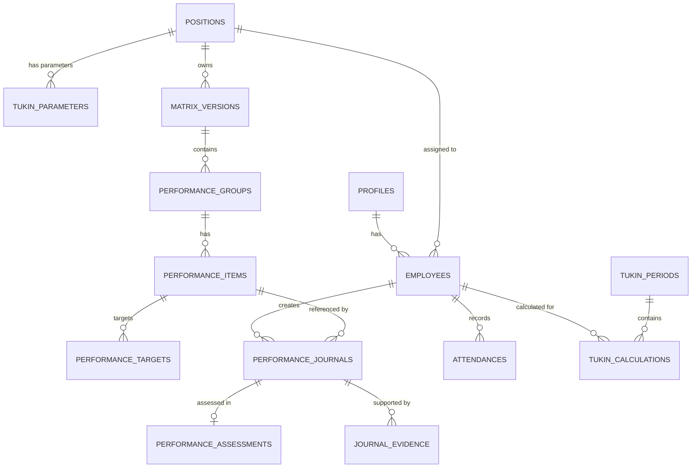
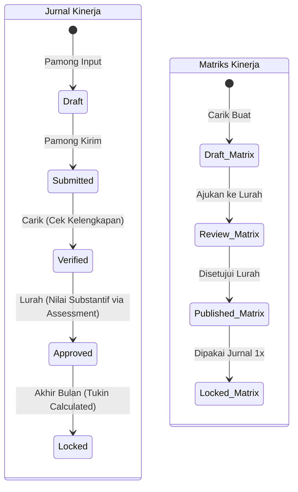

# IMPLEMENTATION SPECIFICATION FINAL V2

Dokumen ini merupakan spesifikasi final arsitektur teknis yang akan langsung diterjemahkan menjadi baris kode dan *SQL Migration*, mengakomodasi aturan bisnis *Final V1* dan koreksi audit akhir.

---

## A. Updated ERD (Entity Relationship Diagram)



---

## B. Updated Table Definitions

### 1. Master Data & Auth
- **`profiles`**: `id` (PK, uuid), `role` (varchar), `full_name` (varchar).
- **`positions`**: `id` (PK, uuid), `name` (varchar), `is_pamong_tukin_eligible` (boolean). *(Digunakan untuk menyaring populasi pembagi Tukin Lurah secara sistematis, tanpa hardcode nama jabatan).*
- **`employees`**: `id` (PK, uuid), `profile_id` (FK), `position_id` (FK), `nip_nipt` (varchar), `status` (varchar), `created_at`, `updated_at`.
- **`village_settings`**: `id` (PK), `setting_key` (varchar, unique), `setting_value` (jsonb).

### 2. Tukin Parameters (Effective-Dated)
- **`tukin_parameters`**: `id` (PK), `position_id` (FK), `min_ckb_target` (int), `pagu_tukin` (numeric), `effective_from` (date), `effective_to` (date, nullable).
  *(Constraint: `EXCLUDE USING gist (position_id WITH =, daterange(effective_from, effective_to) WITH &&)` untuk mencegah overlap periode aktif).*

### 3. Matriks Kinerja
- **`matrix_versions`**: `id` (PK), `position_id` (FK), `version_number` (int), `status` (varchar).
- **`performance_groups`**: `id` (PK), `matrix_version_id` (FK), `name` (varchar).
- **`performance_items`**: `id` (PK), `group_id` (FK), `name` (text), `unit` (varchar).
- **`performance_targets`**: `id` (PK), `item_id` (FK), `annual_target` (int), `monthly_target` (int).

### 4. Presensi & Modul Waktu
- **`attendances`**: `id` (PK), `employee_id` (FK), `attendance_date` (date), `check_in` (timestamptz), `check_out` (timestamptz), `status` (varchar). *(Constraint: `UNIQUE(employee_id, attendance_date)`).*
- **`permissions`** & **`official_duties`**: `id` (PK), `employee_id` (FK), `start_date` (date), `end_date` (date), `reason/purpose` (text), `status` (varchar).

### 5. Jurnal & Penilaian (Pemisahan Tugas)
- **`performance_journals`**: `id` (PK), `employee_id` (FK), `item_id` (FK), `activity_date` (date), `start_time` (time), `end_time` (time), `target_snapshot` (int), `unit_snapshot` (varchar), `realization` (int - murni kuantitas), `location` (varchar), `note` (text), `status` (varchar). *(Constraint: `EXCLUDE USING gist` untuk anti-overlap waktu).*
- **`performance_assessments`**: `id` (PK), `journal_id` (FK, unique), `assessed_realization` (int), `capaian_value` (numeric), `assessment_note` (text), `assessed_by` (FK profiles/Lurah), `assessed_at` (timestamptz).
- **`journal_evidence`**: `id` (PK), `journal_id` (FK), `file_url` (text).

### 6. Calculation Engine (Histori Immutable)
- **`tukin_periods`**: `id` (PK), `period_month` (varchar YYYY-MM), `status` (Draft/Locked).
- **`tukin_calculations`**: `id` (PK), `period_id` (FK), `employee_id` (FK), 
  `position_id_snapshot` (uuid), `pagu_snapshot` (numeric), `min_ckb_snapshot` (int), `formula_version` (varchar),
  `mk` (int), `hk` (int), `pb` (numeric), `ckb` (numeric), `tkb` (int), `actual_kb` (numeric), `kb_used_for_npk` (numeric), 
  `npk` (numeric), `tukin_percentage` (numeric), `disciplinary_adjustment` (numeric), `final_tukin` (numeric).

---

## C. Relationship / FK Rules
- Data historis transaksi (`performance_journals`, `tukin_calculations`, `performance_assessments`) **TIDAK BOLEH** menggunakan `ON DELETE CASCADE` ke tabel Master (`performance_items`, `positions`, `employees`). Gunakan `ON DELETE RESTRICT` untuk mengunci imutabilitas.
- `CASCADE` hanya diizinkan untuk relasi *parent-child* dalam satu kesatuan domain (contoh: `performance_groups` ke `matrix_versions` yang berstatus *Draft*, atau `journal_evidence` ke `performance_journals`).

---

## D. RLS Matrix (Row Level Security)

| Tabel / Domain | Role: Pamong (User) | Role: Carik (Admin) | Role: Lurah (User Evaluator) |
|---|---|---|---|
| Master/Settings/Positions | SELECT | ALL (Manage) | SELECT |
| Matrix Draft/Review | SELECT | ALL (Manage) | SELECT (Review) |
| Matrix Published | SELECT | SELECT | SELECT (Tetapkan) |
| Jurnal Pribadi | ALL (Draft/Submit) | SELECT | SELECT |
| Jurnal Pamong Lain | Ditolak (Denied) | SELECT (Verify) | SELECT (Assess/Approve) |
| Performance Assessments | SELECT (Milik sendiri) | SELECT (View All) | ALL (Mengeksekusi nilai) |
| Tukin Calculations | SELECT (Milik sendiri) | ALL (Kalkulasi) | SELECT |

---

## E. Approval Matrix (State Workflow)

**1. Alur Jurnal Kinerja**
`Draft` (Dibuat Pamong) → `Submitted` (Dikirim Pamong) → `Verified` (Diperiksa kelengkapan administrasi/bukti oleh **Carik**) → `Approved` (Dinilai & diputuskan nilai capaiannya oleh **Lurah**) → `Locked` (Masuk kalkulasi).

**2. Alur Matriks Kinerja**
`Draft` (Dibuat Carik) → `Review` (Diajukan Carik ke Lurah) → `Published` (Disetujui **Lurah**) → `Locked` (Bila sudah digunakan jurnal).

---

## F. Calculation Engine Interface
Sistem akan dirancang dengan abstraksi formula berbasis *Strategy Pattern/Interface* di *Backend* (TypeScript) untuk memastikan logika KB dan Capaian dapat dikonfigurasi secara leluasa begitu keputusannya keluar.

```typescript
// Abstraksi Capaian Parsial (Unresolved)
interface CapaianCalculator {
    calculate(target: number, realization: number): number;
}
// Abstraksi KB Capping (Unresolved)
interface KBCalculator {
    calculateKB(ckb: number, tkb: number): { actualKB: number, kbUsedForNPK: number };
}

// Struct Engine Utama
class TukinEngine {
    constructor(
        private capaianCalc: CapaianCalculator,
        private kbCalc: KBCalculator,
        private formulaVersion: string
    ) {}

    // Eksekusi ketika akhir bulan / saat Jurnal dilock
    public computeFinalCalculation(employeeId, period) {
       // ...Logic perhitungan PB, CK.B, KB, NPK, Persentase...
       // Simpan seluruh state (Snapshot Parameter, Actual KB vs Used KB) ke DB
    }
}
```

---

## G. State Transition Diagram



---

## H. Migration Order
Eksekusi file SQL Migration harus dilakukan berurut untuk menjaga konsistensi FK dan RLS:
1. `001_extensions_and_enums.sql` (UUID, GiST/Btree_gist, tipe status).
2. `002_core_auth.sql` (Profiles, Positions, Employees, Settings).
3. `003_tukin_parameters.sql` (Tukin Parameters dengan daterange constraint).
4. `004_matrix_schema.sql` (Versions, Groups, Items, Targets).
5. `005_attendance_schema.sql` (Attendance, Permission, Duty).
6. `006_journal_schema.sql` (Journals + GiST Exclude constraint, Assessments, Evidence).
7. `007_calculation_schema.sql` (Tukin Periods, Calculations dengan full snapshot).
8. `008_rls_policies.sql` (Kebijakan Keamanan DB ketat).
9. `009_seed_kalidengen.sql` (Data awal Kalurahan Kalidengen).

---

## I. Remaining Unresolved Business Decisions
Keputusan ini murni hak prerogatif Owner dan dibiarkan *Unresolved* pada V1 dengan tetap membangun sistem yang elastis (melalui abstraksi):

1. **Perlakuan Capping KB >100%**: Apakah Kinerja Bulanan dibiarkan menembus batas maksimal atau di-*capping* statis ke 100%.
2. **Capaian Parsial Output**: Mekanisme perhitungan proporsional/matematis apabila angka realisasi berada di bawah angka target minimum.
