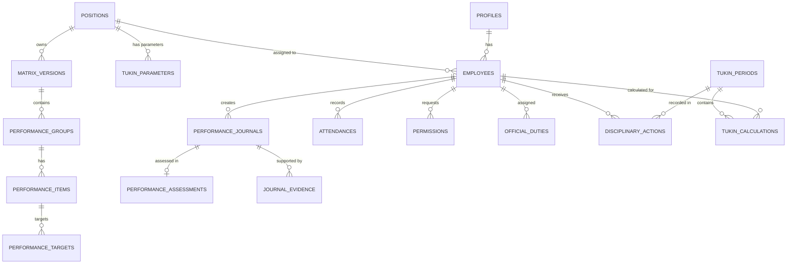

# IMPLEMENTATION SPECIFICATION FINAL V3.1
— DATABASE SCHEMA READY / CALCULATION POLICY PENDING

Dokumen ini merupakan arsitektur teknis level-database yang diperkuat dengan batasan *Immutability*, keutuhan transaksi atomik, serta abstraksi fungsional (kebijakan *Formula Version* dan *Attendance Version*) untuk mewadahi aturan bisnis yang masih tertunda. 

---

## A. Updated ERD (Entity Relationship Diagram)

---

## B. Complete Table Definitions & C. PK/FK Rules

Semua *Foreign Key* (FK) wajib merujuk ke tabel referensi secara eksplisit. Aturan *On Delete* untuk seluruh relasi historis (Jurnal, Kalkulasi, Matriks) adalah **RESTRICT**.

1. **`profiles`**
   - `id` (PK, uuid)
   - `role` (varchar)
   - `full_name` (varchar)

2. **`employees`**
   - `id` (PK, uuid)
   - `profile_id` (FK `profiles.id`, RESTRICT)
   - `position_id` (FK `positions.id`, RESTRICT)
   - `status` (varchar)

3. **`positions`**
   - `id` (PK, uuid)
   - `name` (varchar)
   - `is_pamong_tukin_eligible` (boolean)

4. **`tukin_parameters`**
   - `id` (PK, uuid)
   - `position_id` (FK `positions.id`, RESTRICT)
   - `min_ckb_target` (int)
   - `pagu_tukin` (numeric)
   - `effective_from` (date)
   - `effective_to` (date, nullable)

5. **`matrix_versions`**
   - `id` (PK, uuid)
   - `position_id` (FK `positions.id`, RESTRICT)
   - `version_number` (int)
   - `status` (varchar)

6. **`performance_groups`** / **`performance_items`** / **`performance_targets`**
   - Standar sesuai ERD. Relasi FK semuanya **RESTRICT**.

7. **`performance_journals`**
   - `id` (PK, uuid)
   - `employee_id` (FK `employees.id`, RESTRICT)
   - `item_id` (FK `performance_items.id`, RESTRICT)
   - `activity_date` (date)
   - `start_time` (time)
   - `end_time` (time)
   - **Hist. Snapshot**: `matrix_version_id_snapshot`, `group_name_snapshot`, `item_name_snapshot`, `target_snapshot`, `unit_snapshot`
   - `realization` (int)
   - `location` (varchar), `note` (text), `status` (varchar), `return_reason` (text)

8. **`performance_assessments`**
   - `id` (PK, uuid)
   - `journal_id` (FK `performance_journals.id`, RESTRICT)
   - `assessed_realization` (int)
   - `capaian_value` (numeric)
   - `assessment_note` (text)
   - `assessed_by` (FK `profiles.id`, RESTRICT)
   - `assessed_at` (timestamptz)

9. **`journal_evidence`**
   - `id` (PK, uuid), `journal_id` (FK, CASCADE - parent dihapus jk belum submit), `file_url`

10. **`attendances`**, **`permissions`**, **`official_duties`**
    - Referensi ke `employees.id` (RESTRICT). Modul waktu dengan field standar.

11. **`disciplinary_actions`**
    - `id` (PK, uuid), `employee_id` (FK, RESTRICT), `period_id` (FK `tukin_periods.id`, RESTRICT)
    - `adjustment_type` (varchar: 'Lateness', 'Disciplinary Warning')
    - `adjustment_percentage` (numeric)
    - `source_rule` (varchar)
    - `reason` (text)
    - `document_reference` (varchar)
    - `issued_by` (FK `profiles.id`, RESTRICT)

12. **`tukin_periods`**
    - `id` (PK, uuid), `period_month` (varchar YYYY-MM), `status` (varchar: 'Draft', 'Locked')

13. **`tukin_calculations`**
    - `id` (PK, uuid)
    - `period_id` (FK `tukin_periods.id`, RESTRICT)
    - `employee_id` (FK `employees.id`, RESTRICT)
    - `tukin_formula_role` (varchar), `lurah_average_eligible` (boolean)
    - `position_id_snapshot` (uuid), `pagu_snapshot` (numeric), `min_ckb_snapshot` (int)
    - `formula_version` (varchar), `attendance_policy_version` (varchar)
    - `mk`, `hk`, `pb`, `ckb`, `tkb`, `actual_kb`, `kb_used_for_npk`, `npk`
    - `tukin_percentage` (numeric)
    - `disciplinary_adjustment` (numeric)
    - `final_tukin` (numeric)

---

## D. Complete UNIQUE, CHECK, and GiST Constraints

- **UNIQUE**:
  - `tukin_calculations`: `UNIQUE(period_id, employee_id)`
  - `attendances`: `UNIQUE(employee_id, attendance_date)`
  - `tukin_periods`: `UNIQUE(period_month)`
  - `performance_assessments`: `UNIQUE(journal_id)`
- **CHECK**:
  - `performance_journals`: `CHECK (start_time < end_time)`
  - `performance_journals`: `CHECK (status IN ('Draft', 'Submitted', 'Verified', 'Returned', 'Approved', 'Locked'))`
  - `tukin_periods`: `CHECK (status IN ('Draft', 'Locked'))`
- **GiST Exclusion**:
  - `performance_journals`: `EXCLUDE USING gist (employee_id WITH =, tsrange((activity_date + start_time)::timestamp, (activity_date + end_time)::timestamp) WITH &&)`
  - `tukin_parameters`: `EXCLUDE USING gist (position_id WITH =, daterange(effective_from, effective_to) WITH &&)`

---

## E. Full RLS Operation Matrix

Status 'Locked' (baik matriks, jurnal, maupun perhitungan) dan status historis lainnya bersifat **Immutable**. Jika sudah digembok, tidak satupun role yang boleh mengedit atau menghapusnya (Database `UPDATE` / `DELETE` rules must block it).

| Table | Pamong (User) | Carik (Admin) | Lurah (Evaluator) | Immutability Rule |
|---|---|---|---|---|
| `profiles`, `employees`, `positions` | SELECT (Self) | S, I, U, D | SELECT (All) | Soft Delete |
| `tukin_parameters` | SELECT (Self) | S, I, U, D | SELECT (All) | U/D dilarang jika terkait kalkulasi lama |
| `matrix_versions` (+ children) | SELECT | S, I, U, D (Draft) | SELECT, UPDATE (Publish) | `Locked`/`Published` bersifat Immutable |
| `attendances`, `permissions` | S, I, U (Self) | S, I, U, D | SELECT (All) | |
| `performance_journals` | SELECT (Self) INSERT (Self) UPDATE (Self, *Draft/Ret*) DELETE (Self, *Draft*) | SELECT (All) UPDATE (*Verify/Ret*) | SELECT (All) UPDATE (*Approve/Ret*) | `Verified`/`Approved`/`Locked` Immutable bgi Pamong. `Locked` Immutable bgi semua. |
| `journal_evidence` | S, I, D (Self *Draft/Ret*) | SELECT (All) | SELECT (All) | |
| `performance_assessments` | SELECT (Self) | SELECT (All) | SELECT (All) INSERT/UPDATE (*Appr*) | `Locked` = Immutable |
| `disciplinary_actions` | SELECT (Self) | SELECT (All) | S, I, U (Terbitkan) | `Locked Period` = Immutable |
| `tukin_periods` | SELECT | S, I | SELECT | `Locked` = Immutable |
| `tukin_calculations` | SELECT (Self) | SELECT (All) | SELECT (All) | Mutlak Immutable via User Klien. Modifikasi hanya via Atomic RPC `generate_calculations()`. |

---

## F. State Transition Matrix (Jurnal)

| Current | Target | Who Executes | Condition / Rule |
|---|---|---|---|
| *None* | `Draft` | Pamong | Milik sendiri |
| `Draft` / `Returned` | `Submitted` | Pamong | Milik sendiri |
| `Submitted` | `Returned` | Carik | Wajib menyertakan `return_reason` |
| `Submitted` | `Verified` | Carik | Administratif |
| `Verified` | `Returned` | Lurah | Wajib menyertakan `return_reason` |
| `Verified` | `Approved` | Lurah | Substantif (Evaluasi & *Assessment*) |
| `Approved` | `Locked` | Sistem (RPC) | Satu arah saat generate kalkulasi. Immutable. |

---

## G. RPC Authorization Matrix

- `submit_journal()`: Autorisasi = Pemilik jurnal. State murni `Draft` atau `Returned`.
- `return_journal()`: Autorisasi = Carik (bila status `Submitted`), Lurah (bila status `Verified`).
- `verify_journal()`: Autorisasi = Carik. State murni `Submitted`.
- `approve_journal()`: Autorisasi = Lurah murni (`Is_Lurah_Check()`). State `Verified`.
- `generate_calculations()`: Autorisasi = Carik / CRON Sistem. (Lurah tidak berhak memicu generator finansial, namun Lurah penentu *Approve*). Transisi `Approved` → `Locked`.

---

## H. Atomic Calculation Transaction Specification

Fungsi `generate_calculations(period_id)` merupakan transaksi berantai yang tidak terpisahkan (ATOMIC). Apabila satu tahapan gagal (misalnya 1 pegawai datanya inkonsisten), SELURUH PROSES ROLLBACK. Tidak boleh ada separuh rekaman kalkulasi di database.

**Langkah Transaksi:**
1. `BEGIN TRANSACTION`.
2. **VALIDATE ALL INPUTS**: Cek status periode, integritas pamong aktif, ketersediaan `tukin_parameters` bulan terkait.
3. **CALCULATE ALL ELIGIBLE EMPLOYEES**: 
   - Tarik *attendance_policy_version*. (Hitung PB).
   - Tarik `performance_assessments` dari jurnal `Approved`.
   - Tarik `formula_version`. (Hitung CK.B, KB, NPK, Tukin Pamong + `disciplinary_actions`).
   - Ekstrak agregat Tukin Lurah `average_eligible_percentage`.
4. **VALIDATE ALL RESULTS**: Verifikasi `tukin_percentage` dan `final_tukin` bebas dari Not-a-Number (NaN) atau anomali negatif.
5. **INSERT CALCULATIONS**: Simpan *FULL SNAPSHOT* ke tabel `tukin_calculations`.
6. **LOCK APPROVED JOURNALS**: Tandai seluruh jurnal yang diekstrak CK.B nya tadi dengan status `Locked`. Tandai `tukin_periods` menjadi `Locked`.
7. `COMMIT`.

---

## I. Formula Version Strategy
Kolom `formula_version` pada tabel `tukin_calculations` tidak sekadar berfungsi sebagai label statis, namun mengidentifikasi seluruh konstelasi perilaku matematika pada bulan tersebut, yang terdiri atas:
- Rumus PB, CK.B, dan KB.
- Perilaku Capping KB (>100%).
- Penentuan Interval NPK.
- Perilaku Pembulatan (Rounding) NPK.
- Persentase Tukin Mutlak.
- Perilaku Pemotongan Sanksi (Disciplinary).

---

## J. Attendance Policy Version Strategy
Kolom `attendance_policy_version` bertugas membungkus seluruh kebijakan presensi yang masih menggantung, guna mengantisipasi perubahan tata laksana MK dan HK. Konfigurasi ini mendikte Engine perihal status kehadiran yang sah: *leave* (cuti), *permission* (izin), *official duty* (dinas luar), atau toleransi keterlambatan.

---

## K. Historical Snapshot Strategy
Pilar `Immutability` dibentuk secara absolut. Meskipun *Master* Matriks, Parameter Posisi, atau Sanksi Pegawai diubah pada bulan-bulan berikutnya, data kalkulasi historis (*Locked*) akan 100% mempertahankan rekam jejak independen via kolom:
`matrix_version_id_snapshot`, `group_name_snapshot`, `item_name_snapshot`, `target_snapshot`, `unit_snapshot`, `position_id_snapshot`, `pagu_snapshot`, `min_ckb_snapshot`, `disciplinary_adjustment`. 

---

## L. Lurah Calculation Strategy
Perhitungan absolut: `average_eligible_percentage * pagu_snapshot`.
Rata-rata (`average_eligible_percentage`) diekstrak dari populasi pegawai yang ditandai dengan flag snapshot `lurah_average_eligible = TRUE` pada tabel `tukin_calculations` (sesuai *position* Carik, Kaur, Kasi, Dukuh saat transaksi terjadi, di luar Lurah/Bamuskal). Populasi "Staf" diset = `FALSE` kecuali peraturan mengubahnya. 

---

## M. Disciplinary Adjustment Strategy
Sanksi dipisahkan dengan sangat spesifik melalui entitas `disciplinary_actions`. Sanksi `Lateness` dibedakan dari `Disciplinary Warning`. Besaran (`adjustment_percentage`) direkam berserta rujukan dokumen pendukung (`document_reference`). Nilainya kemudian diekstrak dan disuntikkan secara persisten ke kolom `disciplinary_adjustment` di dalam `tukin_calculations`.

---

## N. Migration Order
*Sequential Deployment:*
1. `001_core_and_auth` (Extension, Roles, Profiles, Positions, Employees, Settings)
2. `002_tukin_parameters` (Parameters + GiST)
3. `003_matrix` (Matrix + CASCADE draft / RESTRICT rule)
4. `004_attendance` (Attendances, Permissions, Duties)
5. `005_journals` (Journals + Assessments + Evidence + GiST)
6. `006_disciplinary` (Disciplinary Actions)
7. `007_calculations` (Periods, Tukin Calculations + Atomic Structure)
8. `008_rls_and_rpc` (RLS Matrix + RPC Server Actions)
9. `009_seed_kalidengen` (Seed)

---

## O. Kalidengen Seed Requirements
- `village_settings`: Identitas Dasar.
- `positions`: 8 Jabatan Resmi (Dengan `is_pamong_tukin_eligible` disesuaikan).
- `tukin_parameters`: Target CK.B & Pagu dengan `effective_from`.
- `profiles` & `employees`: 10 orang staf definitif Kalidengen.
- Master Matriks tanpa diikutkan *Bamuskal*.

---

## P. Remaining Unresolved Business Decisions
Keputusan bisnis yang sengaja DITUNDA dan diwadahi (*deferred*) oleh mesin logika fleksibel (*Formula Version* / *Attendance Version*):
1. **KB Capping**: Pemotongan Kinerja (KB) di batas absolut 100%.
2. **Partial Realization (Parsial)**: Penghitungan nilai capaian atas output yang jumlah realisasinya di bawah *Target*.
3. **NPK Rounding (Desimal)**: Tata letak matematis batas interval kontinu atau interupsi desimal.
4. **Definisi MK Presensi**: Validitas ketidakhadiran (Cuti, Izin, Sakit, Dinas Luar) sebagai ekuivalensi Masuk Kerja (MK).
