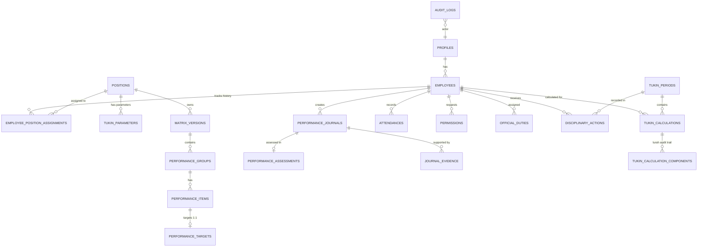

# IMPLEMENTATION SPECIFICATION FINAL V3.2.1
— FINAL HARDENING PATCH

Dokumen ini merupakan arsitektur pamungkas (*Final Hardening Patch*) sebelum transisi ke penulisan *SQL Migration*. Seluruh kerentanan transaksional, anomali histori, dan celah otorisasi telah ditambal dengan proteksi tingkat-basis data.

---

## 1. Updated ERD (Entity Relationship Diagram) **[FINAL HARDENING PATCH]**
Relasi `PROFILES` ke `ASSIGNMENTS` telah diluruskan agar melewati `EMPLOYEES`. Tabel waktu kembali diintegrasikan secara utuh.

---

## 2. Table Definitions & Integrity Rules **[FINAL HARDENING PATCH]**

### A. Employee Active History & Assignments
- **`employee_position_assignments`**: `id`, `employee_id`, `position_id`, `status` (active/inactive), `effective_from` (date), `effective_to` (date, nullable).
  - *Integrity*: `CHECK (effective_to > effective_from)`. *GiST Daterange* mencegah overlap penugasan `active` untuk pegawai yang sama. Engine kalkulasi menilai *eligibility* Tukin dari tabel ini (status=active, rentang meliputi bulan kalkulasi), bukan dari `employees.status`.

### B. Matrix & Parameters Effective Dates
- **`matrix_versions`** & **`tukin_parameters`**: Mengadopsi rentang *half-open* `[effective_from, effective_to)`. `NULL` = *open-ended*.
  - *Integrity*: *Conditional GiST Constraint* memastikan TIDAK BOLEH ada dua parameter/matriks `Published` yang *overlap* untuk posisi yang sama di hari yang sama.

### C. Performance Target Integrity
- **`performance_targets`**: Memiliki aturan ketat `UNIQUE(item_id)` yang mengemas `annual_target`, `monthly_target`, dan `unit` dalam satu rekam mutlak per item (1:1).

### D. Lurah Calculation Audit Trail
- **`tukin_calculation_components`**: `id`, `lurah_calculation_id` (FK), `source_employee_id` (FK), `source_percentage_snapshot` (numeric). Murni berfungsi sebagai jejak audit rekam medis populasi Carik/Kasi/Kaur/Dukuh pembentuk rerata gaji Lurah tanpa mengubah formula asli.

---

## 3. RLS Operation Matrix Final **[FINAL HARDENING PATCH]**

| Tabel / Domain | Pamong (User) | Carik (Admin) | Lurah (Evaluator) | Trusted System (RPC / Triggers) |
|---|---|---|---|---|
| `profiles`, `employees`, `positions` | SELECT (Self) | SELECT, INSERT, UPDATE, DELETE | SELECT (All) | SELECT, INSERT, UPDATE, DELETE |
| `employee_position_assignments` | SELECT (Self) | SELECT, INSERT, UPDATE | SELECT (All) | SELECT, INSERT, UPDATE |
| `tukin_parameters`, `matrix_versions`, `groups`, `items`, `targets` | SELECT (Bila Aktif/Published) | SELECT, INSERT, UPDATE, DELETE (Hanya jika belum locked) | SELECT (All) UPDATE (Hanya state Publish via RPC) | SELECT, INSERT, UPDATE, DELETE |
| `attendances`, `permissions`, `duties` | SELECT, INSERT, UPDATE (Self) | SELECT, INSERT, UPDATE, DELETE | SELECT (All) | SELECT, INSERT, UPDATE, DELETE |
| `performance_journals` | SELECT (Self) INSERT (Self) UPDATE (Self, *Draft/Ret*) DELETE (Self, *Draft*) | SELECT (All) INSERT, UPDATE, DELETE = **DENY** | SELECT (All) INSERT, UPDATE, DELETE = **DENY** | SELECT, INSERT, UPDATE |
| `journal_evidence` | SELECT, INSERT, DELETE (Self *Draft/Ret*) | SELECT (All) | SELECT (All) | SELECT, INSERT, UPDATE, DELETE |
| `performance_assessments` | SELECT (Self) | SELECT (All) | SELECT (All) INSERT/UPDATE = **DENY** | SELECT, INSERT, UPDATE |
| `disciplinary_actions` | SELECT (Self) | SELECT (All) | SELECT, INSERT, UPDATE | SELECT, INSERT, UPDATE |
| `tukin_periods`, `calculations`, `calculation_components` | SELECT (Self) | SELECT (All) | SELECT (All) | SELECT, INSERT, UPDATE |
| `audit_logs` | SELECT (Milik sendiri) | SELECT (All) | SELECT (All) | **HANYA INSERT** via Triggers |

*(Semua manipulasi state/Jurnal/Asesmen oleh Carik/Lurah hanya dilegalkan via RPC)*.

---

## 4. Storage Evidence Authorization **[FINAL HARDENING PATCH]**
Kebijakan keamanan *Storage Bucket* (`evidence/{employee_id}/{YYYY-MM}/{uuid}.ext`) dikunci berbasis RLS otoritatif, bukan dari klaim URL:
- **Pamong**: Otorisasi dipastikan dari ekstrak `auth.uid()` → `profile_id` → `employee_id`. Hanya dapat `INSERT` jika Jurnal belum *Submitted*. Hanya dapat mendelet milik sendiri di *Draft*.
- **Carik & Lurah**: Hanya `SELECT`. `UPDATE/DELETE` = DENY.
- Bukti menjadi absolut *Immutable* setelah Jurnal menyeberang ke status `Submitted`.

---

## 5. Audit Trigger & Immutability **[FINAL HARDENING PATCH]**
Tabel `audit_logs` ditutup rapat dari intervensi klien (`INSERT = DENY`, `UPDATE = DENY`, `DELETE = DENY`).
Perekaman dikendalikan tunggal oleh *Trusted PostgreSQL Triggers* yang menangkap *Event*:
- `INSERT`, `UPDATE`, `DELETE` untuk seluruh tabel Master, Assignment, dan Parameter.
- `STATE TRANSITION` mutlak (seperti Publish Matriks, Verify, Approve, Return, Generate, Lock Period).
- `before_snapshot` dan `after_snapshot` menjamin rekam jejak atomik tanpa *recursive loop*.

---

## 6. RPC Authorization Final **[FINAL HARDENING PATCH]**
*Client* dilarang menyuntikkan ID Aktor (`assessed_by`, identitas *role*, dll). PostgreSQL mencabutnya mutlak dari `auth.uid()`.
- `submit_journal`: Otentikasi kepemilikan.
- `verify_journal`: Otentikasi → `role = admin` AND aktif di `employee_position_assignments.position_id = Carik`.
- `approve_journal`: Otentikasi → aktif di `position_id = Lurah`. (Lurah menyuntikkan nilai asesmen).
- `return_journal`: Logika bercabang. Carik me-return `Submitted`. Lurah me-return `Verified`.

---

## 7. Atomic Calculation Transaction Specification **[FINAL HARDENING PATCH]**
RPC `generate_calculations(period_id)` merupakan satu bingkai transaksi utuh (*Transaction Boundary* internal DB).
1. **Otentikasi & Otorisasi**: Verifikasi `auth.uid()` sebagai Carik atau *Trusted System*.
2. **Locking**: Mengeksekusi Row-Level Lock (`SELECT FOR UPDATE`) pada `tukin_periods` untuk mematikan *race condition* atau klik ganda.
3. **State Check**: Validasi periode berstatus `Draft`.
4. **Input Validation**: Memeriksa *Assignment*, *Parameter*, Matriks, dan Jurnal valid.
5. **Calc Pamong**: Menarik PB, CB.K, dan sanksi.
6. **Calc Lurah**: Ekstraksi komponen dan rerata, menulis *audit komponen*.
7. **Result Validation**: Mencegah keluaran *NaN* atau hitungan parsial.
8. **Insertion**: Menyuntikkan seluruh `tukin_calculations`.
9. **Lock Relations**: Status *Approved* pada Jurnal sumber ditarik menjadi `Locked`. Status Periode dikunci menjadi `Locked`.
10. **Audit**: Perekaman Trigger.
11. **Finalisasi**: Jika ada *exception* seditik pun pada pegawai mana pun, `EXCEPTION -> ROLLBACK` diaktifkan secara holistik. Jika sukses total, `COMMIT`.

---

## 8. Migration Order
001 `core` (Auth, Extension, Enums, Profiles)
002 `employees` (Positions, Assignments, Histori)
003 `tukin_parameters` (Parameters + GiST Rentang)
004 `matrix` (Matrix + Restrict FK Rule)
005 `attendance` (Attendances, Permissions, Official Duties)
006 `journals` (Journals + Assessments + GiST Waktu)
007 `storage` (Buckets + RLS Mutlak)
008 `disciplinary` (Lateness vs Warning)
009 `calculations` (Periods, Calc Engine, Lurah Audit Component)
010 `audit_logs` (Audit Tables + Immutable RLS + Triggers Event)
011 `rls` (Policies RLS Keseluruhan)
012 `rpc` (Security Definer Server Actions)
013 `seed` (Kalidengen).

---

## 9. Deferred Business Decisions (Do Not Change)
Klausul ini dibiarkan menggantung, diisolasi via abstraksi `formula_version` & `attendance_policy_version`:
1. *Capping* Nilai Kinerja (KB) >100%.
2. *Partial Realization* atas capaian *Output*.
3. Pembulatan (Rounding) interval desimal NPK.
4. Interpretasi kehadiran Cuti/Izin/Dinas Luar dalam nilai `MK`.

---

## 10. FINAL VALIDATION (Self-Audit V3.2.1)

| Finding V3.2 | Patch Applied | Section V3.2.1 | Status |
|---|---|---|---|
| Atomic RPC transaction boundary | Transaksi atomik dg Row Lock, Rollback | Section 7 | CLOSED |
| Audit log RLS | Mutlak Deny untuk client. Trigger-only | Section 5, 3 | CLOSED |
| Audit trigger coverage | Trigger komprehensif tanpa loop | Section 5 | CLOSED |
| ERD consistency | Permissions & Duties diintegrasikan kembali | Section 1 | CLOSED |
| Profile/employee/assignment relation | Diluruskan via EMPLOYEES | Section 1, 2 | CLOSED |
| Matrix & Parameter effective dates | Rentang `[)` dg Daterange Constraint | Section 2 | CLOSED |
| Employee assignment integrity | UNIQUE/EXCLUDE rentang tanggal aktif | Section 2 | CLOSED |
| Employee active history | Status ditarik dari *Assignments* aktif | Section 2 | CLOSED |
| Storage authorization | RLS berantai (UID->Profile->Emp) | Section 4 | CLOSED |
| Lurah component audit | Entitas `tukin_calculation_components` dirilis | Section 1, 2 | CLOSED |
| Performance target integrity | `UNIQUE(item_id)` | Section 2 | CLOSED |
| Migration order | `audit_logs` diletakkan pra-RLS/RPC | Section 8 | CLOSED |

---

## 11. FINAL READINESS CLASSIFICATION

- **DATABASE SCHEMA**: READY
- **SECURITY & RLS**: READY
- **HISTORICAL INTEGRITY**: READY
- **AUDIT TRAIL**: READY
- **STORAGE SECURITY**: READY
- **CALCULATION ENGINE**: READY / POLICY PENDING
- **BUSINESS RULE**: DO NOT CHANGE
- **SQL MIGRATION**: READY FOR NEXT PHASE

**Spesifikasi Teknis V3.2.1 telah terkunci secara definitif. Siklus analisis dihentikan dan sistem ini secara struktural absolut siap dieksekusi menjadi *SQL Migrations & Database Implementation*.**
