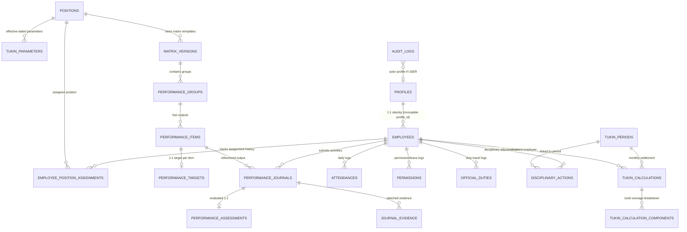

# IMPLEMENTATION SPECIFICATION FINAL V3.2.2.1
— FINAL CRITICAL & INTEGRITY PATCH

Dokumen ini merupakan spesifikasi penyempurnaan mutlak (*Final Critical & Integrity Patch*) terhadap V3.2.2 sebelum masuk ke tahap penulisan kode migrasi SQL Supabase/PostgreSQL. Seluruh 6 patch penyempurnaan diberi label **[FINAL CRITICAL/INTEGRITY PATCH]**.

---

## 1. Executive Summary
Spesifikasi V3.2.2.1 mengunci enam temuan kritis dan integritas akhir:
1. Koreksi skala matematis formula Tukin Lurah (skala persentase 0–100 dinormalisasi dengan pembagi 100 terhadap nominal Rupiah).
2. Penutupan celah eskalasi hak akses (*privilege escalation*) pada `profiles.role` dan pembekuan `employees.profile_id`.
3. Penegasan semantik `tukin_periods.locked_by` (bernilai `NULL` jika dieksekusi otomatis oleh `SYSTEM`).
4. Penambahan aturan integritas kalender `CHECK (end_date >= start_date)` pada `permissions` dan `official_duties`.
5. Penegasan kewajiban `effective_from NOT NULL` pada `matrix_versions` berstatus *Published* dan *Locked*.
6. Penambahan aturan integritas `UNIQUE(lurah_calculation_id, source_employee_id)` pada `tukin_calculation_components`.

Dokumen ini menjadi spesifikasi final berstatus **DATABASE SCHEMA READY** untuk eksekusi langsung ke **SQL Migration**.

---

## 2. Updated ERD (Entity Relationship Diagram)



---

## 3. Complete Table Definitions & Constraints **[FINAL CRITICAL/INTEGRITY PATCH]**

1. **`profiles`**
   - `id` (uuid, PK ref auth.users)
   - `role` (varchar: 'admin' | 'user') **[FINAL CRITICAL/INTEGRITY PATCH]**: Client UPDATE `role` = **DENY**. Perubahan role hanya melalui operasi provisioning terotorisasi di server.
   - `full_name` (varchar)
   - `created_at` (timestamptz), `updated_at` (timestamptz)

2. **`positions`**
   - `id` (uuid, PK)
   - `name` (varchar, UNIQUE)
   - `is_pamong_tukin_eligible` (boolean default false)
   - `created_at`, `updated_at`

3. **`employees`**
   - `id` (uuid, PK)
   - `profile_id` (uuid, FK profiles.id, RESTRICT, UNIQUE) **[FINAL CRITICAL/INTEGRITY PATCH]**: Bersifat *immutable* setelah dibuat; klien dilarang memindahkan relasi `profile_id` secara langsung.
   - `nip_nipt` (varchar, nullable)
   - `created_at`, `updated_at`

4. **`employee_position_assignments`**
   - `id` (uuid, PK)
   - `employee_id` (uuid, FK employees.id, RESTRICT)
   - `position_id` (uuid, FK positions.id, RESTRICT)
   - `status` (varchar: 'active' | 'inactive')
   - `effective_from` (date)
   - `effective_to` (date, nullable)
   - `created_at`, `updated_at`
   - *Constraints*: `CHECK (effective_to IS NULL OR effective_to > effective_from)`, `CHECK (status IN ('active', 'inactive'))`.
   - *Exclusion Constraint*: `EXCLUDE USING gist (employee_id WITH =, daterange(effective_from, coalesce(effective_to, 'infinity'::date), '[)') WITH &&) WHERE (status = 'active')`.

5. **`village_settings`**
   - `id` (uuid, PK), `setting_key` (varchar, UNIQUE), `setting_value` (jsonb), `created_at`, `updated_at`.

6. **`tukin_parameters`**
   - `id` (uuid, PK)
   - `position_id` (uuid, FK positions.id, RESTRICT)
   - `min_ckb_target` (int)
   - `pagu_tukin` (numeric(15,2))
   - `effective_from` (date)
   - `effective_to` (date, nullable)
   - `created_at`, `updated_at`
   - *Constraints*: `CHECK (effective_to IS NULL OR effective_to > effective_from)`, `CHECK (pagu_tukin >= 0 AND min_ckb_target >= 0)`.
   - *Exclusion Constraint*: `EXCLUDE USING gist (position_id WITH =, daterange(effective_from, coalesce(effective_to, 'infinity'::date), '[)') WITH &&)`.

7. **`matrix_versions`** **[FINAL CRITICAL/INTEGRITY PATCH]**
   - `id` (uuid, PK)
   - `position_id` (uuid, FK positions.id, RESTRICT)
   - `version_number` (int)
   - `status` (varchar: 'Draft' | 'Review' | 'Published' | 'Locked')
   - `effective_from` (date, nullable)
   - `effective_to` (date, nullable)
   - `created_at`, `updated_at`
   - *Constraints*:
     - `UNIQUE(position_id, version_number)`.
     - `CHECK (effective_to IS NULL OR effective_to > effective_from)`.
     - `CHECK ((status IN ('Draft', 'Review')) OR (status IN ('Published', 'Locked') AND effective_from IS NOT NULL))` **[FINAL CRITICAL/INTEGRITY PATCH]**.
   - *Exclusion Constraint*: `EXCLUDE USING gist (position_id WITH =, daterange(effective_from, coalesce(effective_to, 'infinity'::date), '[)') WITH &&) WHERE (status = 'Published')`.

8. **`performance_groups`**
   - `id` (uuid, PK), `matrix_version_id` (uuid, FK matrix_versions.id, RESTRICT), `name` (varchar), `order_number` (int), `created_at`, `updated_at`.

9. **`performance_items`**
   - `id` (uuid, PK), `group_id` (uuid, FK performance_groups.id, RESTRICT), `name` (text), `unit` (varchar), `order_number` (int), `created_at`, `updated_at`.

10. **`performance_targets`**
    - `id` (uuid, PK), `item_id` (uuid, FK performance_items.id, RESTRICT, UNIQUE), `annual_target` (int), `monthly_target` (int), `created_at`, `updated_at`.

11. **`attendances`**
    - `id` (uuid, PK), `employee_id` (uuid, FK employees.id, RESTRICT), `attendance_date` (date), `check_in` (timestamptz, nullable), `check_out` (timestamptz, nullable), `status` (varchar), `note` (text, nullable), `created_at`, `updated_at`.
    - *Constraint*: `UNIQUE(employee_id, attendance_date)`.

12. **`permissions`** **[FINAL CRITICAL/INTEGRITY PATCH]**
    - `id` (uuid, PK), `employee_id` (uuid, FK employees.id, RESTRICT), `start_date` (date), `end_date` (date), `permission_type` (varchar: 'cuti' | 'izin' | 'sakit' | 'lainnya'), `reason` (text), `status` (varchar: 'Draft' | 'Submitted' | 'Approved' | 'Rejected'), `approved_by` (uuid, FK profiles.id, RESTRICT, nullable), `approved_at` (timestamptz, nullable), `evidence_url` (text, nullable), `created_at`, `updated_at`.
    - *Constraint*: `CHECK (end_date >= start_date)`.

13. **`official_duties`** **[FINAL CRITICAL/INTEGRITY PATCH]**
    - `id` (uuid, PK), `employee_id` (uuid, FK employees.id, RESTRICT), `start_date` (date), `end_date` (date), `duty_type` (varchar), `destination` (varchar), `purpose` (text), `status` (varchar: 'Draft' | 'Submitted' | 'Approved' | 'Rejected'), `approved_by` (uuid, FK profiles.id, RESTRICT, nullable), `approved_at` (timestamptz, nullable), `document_reference` (varchar, nullable), `created_at`, `updated_at`.
    - *Constraint*: `CHECK (end_date >= start_date)`.

14. **`performance_journals`**
    - `id` (uuid, PK), `employee_id` (uuid, FK employees.id, RESTRICT), `item_id` (uuid, FK performance_items.id, RESTRICT), `activity_date` (date), `start_time` (time), `end_time` (time), `matrix_version_id_snapshot` (uuid), `group_name_snapshot` (varchar), `item_name_snapshot` (text), `target_snapshot` (int), `unit_snapshot` (varchar), `realization` (int), `location` (varchar), `note` (text, nullable), `return_reason` (text, nullable), `status` (varchar: 'Draft' | 'Submitted' | 'Verified' | 'Returned' | 'Approved' | 'Locked'), `created_at`, `updated_at`.
    - *Constraints*: `CHECK (start_time < end_time)`, `CHECK (status IN ('Draft', 'Submitted', 'Verified', 'Returned', 'Approved', 'Locked'))`.
    - *Exclusion Constraint*: `EXCLUDE USING gist (employee_id WITH =, tsrange((activity_date + start_time)::timestamp, (activity_date + end_time)::timestamp, '[)') WITH &&)`.

15. **`performance_assessments`**
    - `id` (uuid, PK), `journal_id` (uuid, FK performance_journals.id, RESTRICT, UNIQUE), `assessed_realization` (int), `capaian_value` (numeric(8,4)), `assessment_note` (text, nullable), `assessed_by` (uuid, FK profiles.id, RESTRICT), `assessed_at` (timestamptz), `created_at`, `updated_at`.

16. **`journal_evidence`**
    - `id` (uuid, PK), `journal_id` (uuid, FK performance_journals.id, CASCADE), `file_url` (text), `file_name` (varchar), `file_size` (bigint), `mime_type` (varchar), `created_at`.

17. **`disciplinary_actions`**
    - `id` (uuid, PK), `employee_id` (uuid, FK employees.id, RESTRICT), `period_id` (uuid, FK tukin_periods.id, RESTRICT), `adjustment_type` (varchar), `adjustment_percentage` (numeric(5,2)), `source_rule` (varchar), `reason` (text), `document_reference` (varchar), `issued_by` (uuid, FK profiles.id, RESTRICT), `issued_at` (timestamptz), `created_at`, `updated_at`.

18. **`tukin_periods`** **[FINAL CRITICAL/INTEGRITY PATCH]**
    - `id` (uuid, PK)
    - `period_month` (date, UNIQUE)
    - `status` (varchar: 'Draft' | 'Locked')
    - `locked_at` (timestamptz, nullable)
    - `locked_by` (uuid, FK profiles.id, RESTRICT, nullable) — Bernilai `NULL` jika dikunci otomatis oleh `SYSTEM`
    - `created_at`, `updated_at`
    - *Constraints*: `CHECK (date_trunc('month', period_month) = period_month)`, `CHECK (status IN ('Draft', 'Locked'))`.

19. **`tukin_calculations`**
    - `id` (uuid, PK)
    - `period_id` (uuid, FK tukin_periods.id, RESTRICT)
    - `employee_id` (uuid, FK employees.id, RESTRICT)
    - `tukin_formula_role` (varchar: 'Pamong' | 'Lurah')
    - `lurah_average_eligible` (boolean)
    - `position_id_snapshot` (uuid)
    - `pagu_snapshot` (numeric(15,2))
    - `min_ckb_snapshot` (int)
    - `formula_version` (varchar)
    - `attendance_policy_version` (varchar)
    - `mk` (int), `hk` (int), `pb` (numeric(8,4))
    - `ckb` (numeric(8,4)), `tkb` (int), `actual_kb` (numeric(8,4)), `kb_used_for_npk` (numeric(8,4))
    - `npk` (numeric(8,4))
    - `tukin_percentage` (numeric(5,2))
    - `gross_tukin` (numeric(15,2))
    - `adjustment_amount` (numeric(15,2))
    - `final_tukin` (numeric(15,2))
    - `created_at`, `updated_at`
    - *Constraints*: `UNIQUE(period_id, employee_id)`, `CHECK (tukin_percentage >= 0 AND gross_tukin >= 0 AND final_tukin >= 0)`.

20. **`tukin_calculation_components`** **[FINAL CRITICAL/INTEGRITY PATCH]**
    - `id` (uuid, PK)
    - `lurah_calculation_id` (uuid, FK tukin_calculations.id, RESTRICT)
    - `source_employee_id` (uuid, FK employees.id, RESTRICT)
    - `source_percentage_snapshot` (numeric(5,2)) — Skala 0–100
    - `created_at`
    - *Constraint*: `UNIQUE(lurah_calculation_id, source_employee_id)`.

21. **`audit_logs`**
    - `id` (uuid, PK)
    - `actor_type` (varchar: 'USER' | 'SYSTEM')
    - `actor_profile_id` (uuid, FK profiles.id, RESTRICT, nullable)
    - `action` (varchar: 'INSERT' | 'UPDATE' | 'DELETE' | 'STATE_TRANSITION')
    - `entity_type` (varchar)
    - `entity_id` (uuid)
    - `before_snapshot` (jsonb, nullable)
    - `after_snapshot` (jsonb, nullable)
    - `created_at` (timestamptz default now())
    - *Constraint*: `CHECK ((actor_type = 'USER' AND actor_profile_id IS NOT NULL) OR (actor_type = 'SYSTEM' AND actor_profile_id IS NULL))`.

---

## 4. Historical Integrity & Master Delete Protection
- **Client Direct DELETE = DENY**: Pada seluruh tabel master historis (`profiles`, `employees`, `positions`, `employee_position_assignments`, `tukin_parameters`, `matrix_versions`, `performance_groups`, `performance_items`, `performance_targets`), hak `DELETE` ditutup mutlak dari klien via RLS.
- **Published & Locked = IMMUTABLE**: Matriks dan parameter berstatus *Published* atau *Locked* tidak dapat diubah oleh peran apa pun.

---

## 5. Employee Assignment Integrity
- Satu pegawai maksimal hanya memiliki **satu penugasan aktif** (`status = 'active'`) pada rentang tanggal tertentu: `[effective_from, effective_to)`.
- Menggunakan constraint exclusion GiST daterange.

---

## 6. Matrix & Parameter Versioning **[FINAL CRITICAL/INTEGRITY PATCH]**
- Rentang waktu half-open `[effective_from, effective_to)`. `effective_to = NULL` berarti berlaku terbuka (*open-ended*).
- **Matrix Versions**: Draf dan Review boleh memiliki `effective_from = NULL`. Namun saat berstatus *Published* atau *Locked*, `effective_from` **WAJIB NOT NULL**.
- Tidak boleh ada matriks *Published* yang tumpang tindih untuk jabatan yang sama.

---

## 7. Attendance Architecture
- Tabel `attendances`, `permissions`, dan `official_duties` merekam data log waktu faktual.
- Evaluasi nilai `MK` (Masuk Kerja) dan `HK` (Hari Kerja) dieksekusi secara terisolasi oleh mesin kalkulasi berdasarkan `attendance_policy_version`.

---

## 8. Journal Validation Chain
Ketika jurnal diajukan (`submit_journal`), basis data/RPC memvalidasi rantai 9 lapis:
$$\text{auth.uid()} \rightarrow \text{profile} \rightarrow \text{employee} \rightarrow \text{active assignment} \rightarrow \text{position} \rightarrow \text{published matrix} \rightarrow \text{group} \rightarrow \text{item} \rightarrow \text{target}$$

Seluruh field snapshot diisi otomatis dari database internal, menolak payload snapshot dari frontend.

---

## 9. Journal State Machine & Transitions
```
None ──(Pamong create)──> Draft
Draft / Returned ──(Pamong submit_journal)──> Submitted
Submitted ──(Carik verify_journal)──> Verified
Submitted ──(Carik return_journal + reason)──> Returned
Verified ──(Lurah return_journal + reason)──> Returned
Verified ──(Lurah approve_journal + assessment)──> Approved
Approved ──(System generate_calculations)──> Locked
```
- Seluruh transisi wajib melalui RPC Server (`SECURITY DEFINER`).

---

## 10. Assessment Authorization
Pada `approve_journal()`:
- Database memverifikasi bahwa pemanggil terotentikasi memiliki penugasan posisi aktif sebagai **Lurah** pada tanggal transaksi.
- Parameter `assessed_by` otomatis disuntikkan dari profil Lurah hasil kueri server.

---

## 11. Evidence Security
- Relasi `journal_evidence` ke `performance_journals` menggunakan `ON DELETE CASCADE` hanya sah selama jurnal berstatus `'Draft'` atau `'Returned'`.
- Setelah jurnal berstatus `'Submitted'`, `'Verified'`, `'Approved'`, atau `'Locked'`, kebijakan RLS memblokir `INSERT`, `UPDATE`, dan `DELETE`.

---

## 12. Disciplinary Architecture & Semantics
- **Report Lateness**: 5%
- **Disciplinary Warning**:
  - Peringatan Lisan: 20%
  - Peringatan Tertulis I: 25%
  - Peringatan Tertulis II: 30%
  - Peringatan Tertulis III: 35%

---

## 13. Calculation Architecture & Semantics (Tukin Pamong)
1. $\text{PB} = (\text{MK} / \text{HK}) \times 100$
2. $\text{KB} = (\text{CK.B} / \text{TK.B}) \times 100$
3. $\text{NPK} = (\text{PB} \times 40\%) + (\text{KB} \times 60\%) = (\text{PB} \times 0.4) + (\text{KB} \times 0.6)$
4. Interval NPK $\rightarrow$ `tukin_percentage` (skala 0–100):
   - $91 \le \text{NPK} \le 100 \rightarrow 100\%$
   - $81 \le \text{NPK} < 91 \rightarrow 90\%$
   - $71 \le \text{NPK} < 81 \rightarrow 70\%$
   - $40 \le \text{NPK} < 71 \rightarrow 40\%$
   - $10 \le \text{NPK} < 40 \rightarrow 10\%$
   - $0 \le \text{NPK} < 10 \rightarrow 0\%$
5. $\text{gross\_tukin} = \text{pagu\_snapshot} \times (\text{tukin\_percentage} / 100)$
6. $\text{adjustment\_amount} = \text{gross\_tukin} \times (\sum \text{adjustment\_percentage} / 100)$
7. $\text{final\_tukin} = \text{gross\_tukin} - \text{adjustment\_amount}$

---

## 14. Lurah Calculation Audit Trail & Scale Correction **[FINAL CRITICAL/INTEGRITY PATCH]**

### Koreksi Skala Matematis:
`tukin_percentage` dan `average_eligible_percentage` tersimpan dalam skala **0–100**.
Maka rumus Tukin Lurah adalah:
$$\text{gross\_tukin Lurah} = \text{pagu\_snapshot Lurah} \times \left(\frac{\text{average\_eligible\_percentage}}{100}\right)$$

**Contoh Audit**:
- Jika $\text{average\_eligible\_percentage} = 90$ dan $\text{pagu Lurah} = \text{Rp446.000}$, maka:
  $$\text{gross\_tukin Lurah} = 446.000 \times \left(\frac{90}{100}\right) = \text{Rp401.400}$$
  *(Bukan Rp446.000 $\times$ 90 = Rp40.140.000).*

### Integritas Komponen:
- Setiap pamong kontributor Lurah dicatat ke `tukin_calculation_components`.
- Constraint `UNIQUE(lurah_calculation_id, source_employee_id)` menjamin satu pegawai hanya dihitung satu kali.

---

## 15. Formula Version Abstraction
Field `formula_version` mengikat implementasi matematis (PB, CKB, KB, Capping, NPK, Desimal Rounding, Sanksi).

---

## 16. Attendance Policy Version Abstraction
Field `attendance_policy_version` mengikat aturan konversi kehadiran faktual ke nilai HK dan MK.

---

## 17. Employee Mutation Policy (Tengah Periode)
- *DEFERRED BUSINESS POLICY*.
- Mesin kalkulasi otomatis menolak (*fail-safe exception*) bila ada pegawai dengan multi-penugasan aktif dalam bulan kalkulasi berjalan.

---

## 18. Audit Log Architecture
- Menjangkau seluruh 20 tabel transaksi dan master.
- Membedakan aktor `USER` (dengan `actor_profile_id` wajib terisi) dan `SYSTEM` (`actor_profile_id = NULL`).
- Seluruh penulisan audit dikendalikan otomatis oleh pemicu (*Trigger*) basis data.

---

## 19. RLS Operation Matrix Final **[FINAL CRITICAL/INTEGRITY PATCH]**

| Tabel / Domain | Pamong (User) | Carik (Admin) | Lurah (Evaluator) | Trusted System / RPC |
|---|---|---|---|---|
| `profiles` | SELECT (Self) | SELECT (All)<br>INSERT (Admin)<br>UPDATE (Admin, **EXCEPT `role`**)<br>DELETE = **DENY** | SELECT (All)<br>DELETE = **DENY** | SELECT, INSERT, UPDATE, DELETE |
| `employees` | SELECT (Self) | SELECT (All)<br>INSERT (Admin)<br>UPDATE (Admin, **EXCEPT `profile_id`**)<br>DELETE = **DENY** | SELECT (All)<br>DELETE = **DENY** | SELECT, INSERT, UPDATE, DELETE |
| `positions` | SELECT (All) | SELECT (All)<br>INSERT, UPDATE (Admin)<br>DELETE = **DENY** | SELECT (All)<br>DELETE = **DENY** | SELECT, INSERT, UPDATE, DELETE |
| `employee_position_assignments` | SELECT (Self) | SELECT (All)<br>INSERT, UPDATE (Admin)<br>DELETE = **DENY** | SELECT (All)<br>DELETE = **DENY** | SELECT, INSERT, UPDATE, DELETE |
| `village_settings` | SELECT (All) | SELECT, UPDATE (Admin)<br>DELETE = **DENY** | SELECT (All)<br>DELETE = **DENY** | SELECT, UPDATE |
| `tukin_parameters` | SELECT (All) | SELECT (All)<br>INSERT, UPDATE (Admin)<br>DELETE = **DENY** | SELECT (All)<br>DELETE = **DENY** | SELECT, INSERT, UPDATE, DELETE |
| `matrix_versions` (+ groups, items, targets) | SELECT (Published/Locked) | SELECT (All)<br>INSERT, UPDATE (Draft only)<br>DELETE = **DENY** | SELECT (All)<br>DELETE = **DENY** | SELECT, INSERT, UPDATE, DELETE |
| `attendances` | SELECT, INSERT, UPDATE (Self) | SELECT, INSERT, UPDATE (All)<br>DELETE = **DENY** | SELECT (All)<br>DELETE = **DENY** | SELECT, INSERT, UPDATE, DELETE |
| `permissions`, `official_duties` | SELECT, INSERT, UPDATE (Self, Draft)<br>DELETE (Self, Draft) | SELECT (All)<br>UPDATE (Admin review)<br>DELETE = **DENY** | SELECT (All)<br>UPDATE (Lurah approval)<br>DELETE = **DENY** | SELECT, INSERT, UPDATE, DELETE |
| `performance_journals` | SELECT (Self)<br>INSERT (Self, Draft)<br>UPDATE (Self, Draft/Returned)<br>DELETE (Self, Draft) | SELECT (All)<br>INSERT, UPDATE, DELETE = **DENY** (via RPC) | SELECT (All)<br>INSERT, UPDATE, DELETE = **DENY** (via RPC) | SELECT, INSERT, UPDATE, DELETE |
| `journal_evidence` | SELECT (Self)<br>INSERT (Self, Draft/Ret)<br>DELETE (Self, Draft/Ret) | SELECT (All)<br>INSERT, UPDATE, DELETE = **DENY** | SELECT (All)<br>INSERT, UPDATE, DELETE = **DENY** | SELECT, INSERT, UPDATE, DELETE |
| `performance_assessments` | SELECT (Self) | SELECT (All)<br>INSERT, UPDATE, DELETE = **DENY** | SELECT (All)<br>INSERT, UPDATE = **DENY** (via RPC) | SELECT, INSERT, UPDATE, DELETE |
| `disciplinary_actions` | SELECT (Self) | SELECT (All)<br>INSERT, UPDATE (Admin)<br>DELETE = **DENY** | SELECT (All)<br>DELETE = **DENY** | SELECT, INSERT, UPDATE, DELETE |
| `tukin_periods` | SELECT (All) | SELECT (All)<br>INSERT (Draft)<br>DELETE = **DENY** | SELECT (All)<br>DELETE = **DENY** | SELECT, INSERT, UPDATE, DELETE |
| `tukin_calculations`, `calculation_components` | SELECT (Self) | SELECT (All)<br>INSERT, UPDATE, DELETE = **DENY** | SELECT (All)<br>INSERT, UPDATE, DELETE = **DENY** | SELECT, INSERT, UPDATE, DELETE |
| `audit_logs` | SELECT (Milik sendiri) | SELECT (All)<br>INSERT, UPDATE, DELETE = **DENY** | SELECT (All)<br>INSERT, UPDATE, DELETE = **DENY** | **INSERT ONLY** via Trigger/RPC |

---

## 20. RPC Authorization Matrix
- `submit_journal`: Pemilik jurnal terotentikasi.
- `return_journal`: Carik (bila status `Submitted`) atau Lurah (bila status `Verified`).
- `verify_journal`: Aktor terotentikasi memiliki `role = 'admin'` DAN penugasan aktif posisi Carik.
- `approve_journal`: Aktor terotentikasi memiliki penugasan aktif posisi Lurah.
- `publish_matrix_version`: Aktor terotentikasi memiliki penugasan aktif posisi Lurah.
- `generate_calculations`: Carik aktif atau Trusted System.

---

## 21. Atomic Transaction Specification (`generate_calculations`) **[FINAL CRITICAL/INTEGRITY PATCH]**
Sesuai mekanisme PostgreSQL, transaksi berjalan atomik dalam pemanggilan fungsi database.
- `SELECT ... FOR UPDATE` pada `tukin_periods` mencegah eksekusi ganda.
- Jika dieksekusi otomatis oleh sistem: `locked_by` diset ke `NULL`. Jika dieksekusi oleh Carik: `locked_by` diset ke `auth.uid()`.
- Seluruh baris kalkulasi pamong dan komponen audit Lurah di-insert dalam satu langkah.
- Setiap eksepsi otomatis memicu pembatalan total (*automatic transaction rollback*).

---

## 22. Storage Security
- Bucket `evidence` privat.
- Upload/delete dibatasi hanya untuk jurnal berstatus `'Draft'` atau `'Returned'`.
- Status `'Submitted'` ke atas mengunci file bukti menjadi absolut *immutable*.

---

## 23. Complete Constraints Summary
- **UNIQUE**: `positions(name)`, `employees(profile_id)`, `performance_targets(item_id)`, `attendances(employee_id, attendance_date)`, `performance_assessments(journal_id)`, `tukin_periods(period_month)`, `tukin_calculations(period_id, employee_id)`, `matrix_versions(position_id, version_number)`, `tukin_calculation_components(lurah_calculation_id, source_employee_id)`.
- **CHECK**: Validasi kalender `permissions` dan `official_duties` (`end_date >= start_date`), validasi jam kerja (`start_time < end_time`), validasi tanggal awal bulan `period_month`, validasi nominal non-negatif, validasi keterikatan `actor_type` pada `audit_logs`, serta validasi `effective_from NOT NULL` pada matriks *Published/Locked*.
- **GiST Exclusion**: Anti-overlap jam jurnal harian, anti-overlap penugasan aktif pamong, anti-overlap parameter Tukin, anti-overlap matriks berstatus *Published*.

---

## 24. Index Strategy
- Pengindeksan terarah pada foreign keys, status aktif, dan rentang tanggal untuk performa tinggi kueri kalkulasi dan audit log.

---

## 25. Migration Order
1. `001_extensions_and_types.sql`
2. `002_core_auth.sql`
3. `003_employee_assignments.sql`
4. `004_village_settings.sql`
5. `005_tukin_parameters.sql`
6. `006_performance_matrix.sql`
7. `007_attendance_modules.sql`
8. `008_journals_and_evidence.sql`
9. `009_disciplinary_actions.sql`
10. `010_tukin_calculations.sql`
11. `011_audit_logging.sql`
12. `012_storage_security.sql`
13. `013_rls_policies.sql`
14. `014_rpc_functions.sql`
15. `015_seed_kalidengen.sql`

---

## 26. Seed Requirements (Kalidengen)
- **8 Jabatan Resmi**: Lurah, Carik, Danarta, Panata Laksana Sarta Pangripta (Palapa), Jagabaya, Ulu-Ulu, Kamituwa, Dukuh.
- **10 Pamong Definitif**: Sunardi (Lurah), Muh. Masruri Mustofa (Carik), Viki Wulandari (Danarta), Agus Endarto (Palapa), Subarno (Jagabaya), Saridi (Ulu-Ulu), Sumardi (Kamituwa), Widi Hartono (Dukuh I), Rendi Ardiyanto (Dukuh II), Edi Supriyanto (Dukuh Sidatan).
- **Template Dukuh**: Digunakan bersama oleh ketiga Dukuh.
- **Staf**: Disimpan sebagai template matriks; tidak ada staf aktif di-seed.
- **Bamuskal**: **TOTAL OUT OF SCOPE**.

---

## 27. Deferred Business Decisions (Do Not Change)
1. **KB Capping > 100%**.
2. **Partial Output Achievement**.
3. **NPK Rounding**.
4. **Valid MK/HK Treatment (Cuti/Izin/Sakit/DL)**.
5. **Mutasi Jabatan di Tengah Periode**.

---

## 28. Self-Audit 6 Patch (V3.2.2.1)

| Patch | Perbaikan | Section | Status |
|---|---|---|---|
| 01 | Koreksi Skala Formula Tukin Lurah (`pagu * (avg_pct / 100)`) | Section 14 | **CLOSED** |
| 02 | Tutup Privilege Escalation (`profiles.role` & `profile_id` immutable) | Section 3, 19 | **CLOSED** |
| 03 | Semantik `locked_by` ketika dieksekusi `SYSTEM` (nullable, `NULL`) | Section 3, 21 | **CLOSED** |
| 04 | Validasi Tanggal `permissions` & `official_duties` (`end_date >= start_date`) | Section 3, 23 | **CLOSED** |
| 05 | Matriks Published/Locked Wajib Memiliki `effective_from NOT NULL` | Section 3, 6, 23 | **CLOSED** |
| 06 | Integritas `UNIQUE(lurah_calculation_id, source_employee_id)` | Section 3, 14, 23 | **CLOSED** |

---

## FINAL READINESS CLASSIFICATION

- **DATABASE SCHEMA**: **READY**
- **SECURITY & RLS**: **READY**
- **HISTORICAL INTEGRITY**: **READY**
- **AUDIT TRAIL**: **READY**
- **STORAGE SECURITY**: **READY**
- **CALCULATION ENGINE**: **READY / POLICY PENDING**
- **BUSINESS RULE**: **DO NOT CHANGE**
- **SQL MIGRATION**: **READY FOR NEXT PHASE**

---
*Spesifikasi V3.2.2.1 telah disahkan sebagai dokumen penutup. Seluruh audit dan penambalan selesai secara sempurna tanpa konflik antar bagian.*
