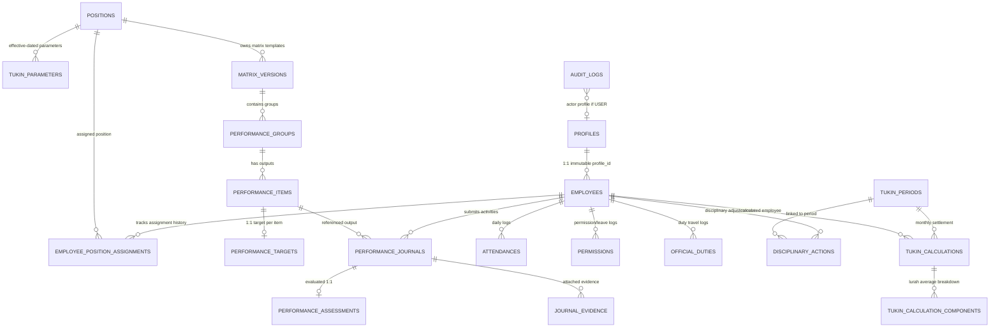

# IMPLEMENTATION SPECIFICATION FINAL V3.2.2.3
— FINAL IDENTITY & TRUST-BOUNDARY PATCH

Dokumen ini merupakan spesifikasi arsitektur final (*Final Identity & Trust-Boundary Patch*) sebelum transisi ke penulisan kode migrasi SQL Supabase/PostgreSQL. Pemutakhiran ini secara khusus mengunci batas kepercayaan (*trust boundary*), proteksi identitas pegawai pada operasi `INSERT` maupun `UPDATE`, pengerasan hak eksekusi (*EXECUTE privilege*), resolusi objek berbasis *schema-qualified*, serta konsistensi berjenjang antara RLS, GRANT/REVOKE, dan Trigger basis data.

---

## 1. Executive Summary
Spesifikasi V3.2.2.3 menyempurnakan V3.2.2.2 dengan 10 ketetapan teknis konkret:
1. **Proteksi Kolom `profiles.role` (INSERT & UPDATE)**: Klien dilarang menetapkan atau mengubah `role`. Penentuan role mutlak diisolasi di bawah *trusted provisioning*.
2. **Definisi Trust Boundary**: Pemisahan tegas antara konteks koneksi klien (`authenticated`) dan konteks *trusted provisioning* server-side.
3. **Pemberantasan Pemalsuan Konteks**: Penolakan mekanisme *session variable* (seperti `set_config`) yang rentan dipalsukan klien sebagai pembuktian hak akses.
4. **Schema-Qualified SECURITY DEFINER**: Penerapan `SET search_path = pg_catalog, public` disertai penulisan objek secara eksplisit (`public.profiles`, `public.employees`, dll.).
5. **Imutabilitas `employees.profile_id`**: Pencegahan pembajakan atau pertukaran identitas pegawai pada saat `INSERT` maupun `UPDATE`.
6. **Konsistensi RLS + GRANT/REVOKE + Trigger**: Integrasi tiga lapis pertahanan (*defense-in-depth*) tanpa ada celah kontradiksi.
7. **Matriks Keamanan Operasi Identitas**: Matriks hak akses untuk Client biasa, Carik, dan Trusted Provisioning.
8. **Restriksi Hak `EXECUTE` RPC**: Pencabutan hak eksekusi dari `PUBLIC` dan pembatasan izin panggil berdasarkan kebutuhan aktor.
9. **Otorisasi Silang (Cross-Reference)**: Penegasan otentikasi berbasis irisan identitas profil dan penugasan posisi aktif.
10. **Non-Regresi**: Menjaga seluruh formula, batas lingkup Bamuskal, dan kebijakan tertunda tetap steril dan tidak berubah.

---

## 2. Updated ERD (Entity Relationship Diagram)

---

## 3. Complete Table Definitions & Constraints

1. **`profiles`**
   - `id` (uuid, PK ref auth.users)
   - `role` (varchar: 'admin' | 'user') **[DATABASE ENFORCEMENT - PATCH 01]**:
     - `REVOKE INSERT (role), UPDATE (role) ON public.profiles FROM authenticated;`
     - Trigger `BEFORE INSERT OR UPDATE` memvalidasi bahwa `role` tidak dapat disuntikkan atau diubah oleh klien biasa.
     - Role hanya dapat ditetapkan melalui *trusted provisioning*.
   - `full_name` (varchar)
   - `created_at` (timestamptz), `updated_at` (timestamptz)
   - *Constraint*: `CHECK (role IN ('admin', 'user'))`.

2. **`positions`**
   - `id` (uuid, PK)
   - `name` (varchar, UNIQUE)
   - `is_pamong_tukin_eligible` (boolean default false)
   - `created_at`, `updated_at`

3. **`employees`**
   - `id` (uuid, PK)
   - `profile_id` (uuid, FK profiles.id, RESTRICT, UNIQUE) **[DATABASE ENFORCEMENT - PATCH 05]**:
     - `REVOKE UPDATE (profile_id) ON public.employees FROM authenticated;`
     - Trigger `BEFORE INSERT` memvalidasi `profile_id` belum pernah dipakai (1:1 mutlak).
     - Trigger `BEFORE UPDATE` melempar eksepsi bila `NEW.profile_id IS DISTINCT FROM OLD.profile_id`.
   - `nip_nipt` (varchar, nullable)
   - `created_at`, `updated_at`

4. **`employee_position_assignments`**
   - `id` (uuid, PK)
   - `employee_id` (uuid, FK employees.id, RESTRICT)
   - `position_id` (uuid, FK positions.id, RESTRICT)
   - `status` (varchar: 'active' | 'inactive')
   - `effective_from` (date)
   - `effective_to` (date, nullable)
   - `created_at`, `updated_at`
   - *Constraints*: `CHECK (effective_to IS NULL OR effective_to > effective_from)`, `CHECK (status IN ('active', 'inactive'))`.
   - *Exclusion*: `EXCLUDE USING gist (employee_id WITH =, daterange(effective_from, coalesce(effective_to, 'infinity'::date), '[)') WITH &&) WHERE (status = 'active')`.

5. **`village_settings`**
   - `id` (uuid, PK), `setting_key` (varchar, UNIQUE), `setting_value` (jsonb), `created_at`, `updated_at`.

6. **`tukin_parameters`**
   - `id` (uuid, PK), `position_id` (uuid, FK positions.id, RESTRICT), `min_ckb_target` (int), `pagu_tukin` (numeric(15,2)), `effective_from` (date), `effective_to` (date, nullable), `created_at`, `updated_at`.
   - *Constraints*: `CHECK (effective_to IS NULL OR effective_to > effective_from)`, `CHECK (pagu_tukin >= 0 AND min_ckb_target >= 0)`.
   - *Exclusion*: `EXCLUDE USING gist (position_id WITH =, daterange(effective_from, coalesce(effective_to, 'infinity'::date), '[)') WITH &&)`.

7. **`matrix_versions`**
   - `id` (uuid, PK), `position_id` (uuid, FK positions.id, RESTRICT), `version_number` (int), `status` (varchar: 'Draft' | 'Review' | 'Published' | 'Locked'), `effective_from` (date, nullable), `effective_to` (date, nullable), `created_at`, `updated_at`.
   - *Constraints*: `UNIQUE(position_id, version_number)`, `CHECK (effective_to IS NULL OR effective_to > effective_from)`, `CHECK ((status IN ('Draft', 'Review')) OR (status IN ('Published', 'Locked') AND effective_from IS NOT NULL))`.
   - *Exclusion*: `EXCLUDE USING gist (position_id WITH =, daterange(effective_from, coalesce(effective_to, 'infinity'::date), '[)') WITH &&) WHERE (status = 'Published')`.

8. **`performance_groups`**
   - `id` (uuid, PK), `matrix_version_id` (uuid, FK matrix_versions.id, RESTRICT), `name` (varchar), `order_number` (int), `created_at`, `updated_at`.

9. **`performance_items`**
   - `id` (uuid, PK), `group_id` (uuid, FK performance_groups.id, RESTRICT), `name` (text), `unit` (varchar), `order_number` (int), `created_at`, `updated_at`.

10. **`performance_targets`**
    - `id` (uuid, PK), `item_id` (uuid, FK performance_items.id, RESTRICT, UNIQUE), `annual_target` (int), `monthly_target` (int), `created_at`, `updated_at`.

11. **`attendances`**
    - `id` (uuid, PK), `employee_id` (uuid, FK employees.id, RESTRICT), `attendance_date` (date), `check_in` (timestamptz, nullable), `check_out` (timestamptz, nullable), `status` (varchar), `note` (text, nullable), `created_at`, `updated_at`.
    - *Constraint*: `UNIQUE(employee_id, attendance_date)`.

12. **`permissions`**
    - `id` (uuid, PK), `employee_id` (uuid, FK employees.id, RESTRICT), `start_date` (date), `end_date` (date), `permission_type` (varchar: 'cuti' | 'izin' | 'sakit' | 'lainnya'), `reason` (text), `status` (varchar: 'Draft' | 'Submitted' | 'Approved' | 'Rejected'), `approved_by` (uuid, FK profiles.id, RESTRICT, nullable), `approved_at` (timestamptz, nullable), `evidence_url` (text, nullable), `created_at`, `updated_at`.
    - *Constraint*: `CHECK (end_date >= start_date)`.

13. **`official_duties`**
    - `id` (uuid, PK), `employee_id` (uuid, FK employees.id, RESTRICT), `start_date` (date), `end_date` (date), `duty_type` (varchar), `destination` (varchar), `purpose` (text), `status` (varchar: 'Draft' | 'Submitted' | 'Approved' | 'Rejected'), `approved_by` (uuid, FK profiles.id, RESTRICT, nullable), `approved_at` (timestamptz, nullable), `document_reference` (varchar, nullable), `created_at`, `updated_at`.
    - *Constraint*: `CHECK (end_date >= start_date)`.

14. **`performance_journals`**
    - `id` (uuid, PK), `employee_id` (uuid, FK employees.id, RESTRICT), `item_id` (uuid, FK performance_items.id, RESTRICT), `activity_date` (date), `start_time` (time), `end_time` (time), `matrix_version_id_snapshot` (uuid), `group_name_snapshot` (varchar), `item_name_snapshot` (text), `target_snapshot` (int), `unit_snapshot` (varchar), `realization` (int), `location` (varchar), `note` (text, nullable), `return_reason` (text, nullable), `status` (varchar: 'Draft' | 'Submitted' | 'Verified' | 'Returned' | 'Approved' | 'Locked'), `created_at`, `updated_at`.
    - *Constraints*: `CHECK (start_time < end_time)`, `CHECK (status IN ('Draft', 'Submitted', 'Verified', 'Returned', 'Approved', 'Locked'))`.
    - *Exclusion*: `EXCLUDE USING gist (employee_id WITH =, tsrange((activity_date + start_time)::timestamp, (activity_date + end_time)::timestamp, '[)') WITH &&)`.

15. **`performance_assessments`**
    - `id` (uuid, PK), `journal_id` (uuid, FK performance_journals.id, RESTRICT, UNIQUE), `assessed_realization` (int), `capaian_value` (numeric(8,4)), `assessment_note` (text, nullable), `assessed_by` (uuid, FK profiles.id, RESTRICT), `assessed_at` (timestamptz), `created_at`, `updated_at`.

16. **`journal_evidence`**
    - `id` (uuid, PK), `journal_id` (uuid, FK performance_journals.id, CASCADE), `file_url` (text), `file_name` (varchar), `file_size` (bigint), `mime_type` (varchar), `created_at`.

17. **`disciplinary_actions`**
    - `id` (uuid, PK), `employee_id` (uuid, FK employees.id, RESTRICT), `period_id` (uuid, FK tukin_periods.id, RESTRICT), `adjustment_type` (varchar), `adjustment_percentage` (numeric(5,2)), `source_rule` (varchar), `reason` (text), `document_reference` (varchar), `issued_by` (uuid, FK profiles.id, RESTRICT), `issued_at` (timestamptz), `created_at`, `updated_at`.

18. **`tukin_periods`**
    - `id` (uuid, PK), `period_month` (date, UNIQUE), `status` (varchar: 'Draft' | 'Locked'), `locked_at` (timestamptz, nullable), `locked_by` (uuid, FK profiles.id, RESTRICT, nullable), `created_at`, `updated_at`.
    - *Constraints*: `CHECK (date_trunc('month', period_month) = period_month)`, `CHECK (status IN ('Draft', 'Locked'))`.

19. **`tukin_calculations`**
    - `id` (uuid, PK), `period_id` (uuid, FK tukin_periods.id, RESTRICT), `employee_id` (uuid, FK employees.id, RESTRICT), `tukin_formula_role` (varchar: 'Pamong' | 'Lurah'), `lurah_average_eligible` (boolean), `position_id_snapshot` (uuid), `pagu_snapshot` (numeric(15,2)), `min_ckb_snapshot` (int), `formula_version` (varchar), `attendance_policy_version` (varchar), `mk` (int), `hk` (int), `pb` (numeric(8,4)), `ckb` (numeric(8,4)), `tkb` (int), `actual_kb` (numeric(8,4)), `kb_used_for_npk` (numeric(8,4)), `npk` (numeric(8,4)), `tukin_percentage` (numeric(5,2)), `gross_tukin` (numeric(15,2)), `adjustment_amount` (numeric(15,2)), `final_tukin` (numeric(15,2)), `created_at`, `updated_at`.
    - *Constraints*: `UNIQUE(period_id, employee_id)`, `CHECK (tukin_percentage >= 0 AND gross_tukin >= 0 AND final_tukin >= 0)`.

20. **`tukin_calculation_components`**
    - `id` (uuid, PK), `lurah_calculation_id` (uuid, FK tukin_calculations.id, RESTRICT), `source_employee_id` (uuid, FK employees.id, RESTRICT), `source_percentage_snapshot` (numeric(5,2)), `created_at`.
    - *Constraint*: `UNIQUE(lurah_calculation_id, source_employee_id)`.

21. **`audit_logs`**
    - `id` (uuid, PK), `actor_type` (varchar: 'USER' | 'SYSTEM'), `actor_profile_id` (uuid, FK profiles.id, RESTRICT, nullable), `action` (varchar: 'INSERT' | 'UPDATE' | 'DELETE' | 'STATE_TRANSITION'), `entity_type` (varchar), `entity_id` (uuid), `before_snapshot` (jsonb, nullable), `after_snapshot` (jsonb, nullable), `created_at` (timestamptz default now()).
    - *Constraint*: `CHECK ((actor_type = 'USER' AND actor_profile_id IS NOT NULL) OR (actor_type = 'SYSTEM' AND actor_profile_id IS NULL))`.

---

## 4. Trust Boundary & Provisioning Architecture **[FINAL IDENTITY & TRUST-BOUNDARY PATCH]**

### A. Definisi Trust Boundary
Sistem memisahkan konteks eksekusi secara absolut:
1. **Client Context (`authenticated`)**:
   - Memiliki peran PostgreSQL `authenticated`.
   - Dibatasi secara ketat oleh RLS dan Column-Level Privileges (`GRANT`/`REVOKE`).
   - Tidak dapat memanipulasi kolom keamanan (`profiles.role`, `employees.profile_id`).
   - Tidak dapat memanggil fungsi internal *trusted provisioning*.
2. **Trusted Provisioning Context**:
   - Operasi server-side terotorisasi (seperti Auth Webhook / Trigger internal yang dijalankan oleh `supabase_admin` / `service_role` / fungsi internal terisolasi).
   - Memiliki kewenangan menetapkan `profiles.role` dan mengikat `employees.profile_id`.
   - Tidak diekspos sebagai fungsi publik yang dapat dipanggil sembarangan oleh `authenticated`.

### B. Anti-Spoofing Context (Pemberantasan Fake Trust Flags)
- Basis data **DILARANG** mempercayai `set_config('app.is_trusted', ...)` atau session variable serupa yang dapat disuntikkan klien lewat kueri SQL/RPC.
- Pembuktian *trusted context* diverifikasi melalui hak akses fungsi (`REVOKE EXECUTE ... FROM authenticated, PUBLIC`) dan kueri terverifikasi pada identitas `auth.uid()`.

---

## 5. Security Enforcement Matrix **[FINAL IDENTITY & TRUST-BOUNDARY PATCH]**

| Operasi | Client (`authenticated`) | Carik (Admin) | Trusted Provisioning |
|---|---|---|---|
| Create `profiles` | DENY direct | DENY direct | **ALLOW** |
| Set `profiles.role` | **DENY** | **DENY** | **ALLOW** |
| Update `profiles.role` | **DENY** | **DENY** | **ALLOW** |
| Create `employees` | DENY direct | DENY direct / Controlled RPC | **ALLOW** |
| Set `employees.profile_id` | **DENY** | **DENY direct** | **ALLOW** |
| Update `employees.profile_id` | **DENY** | **DENY** | **Controlled Only** |
| Change ordinary profile fields (`full_name`) | Sesuai RLS (Self) | ALLOW | ALLOW |
| Change ordinary employee fields (`nip_nipt`) | Sesuai RLS (Self) | ALLOW | ALLOW |

---

## 6. Historical Integrity & Master Delete Protection
- **Client Direct DELETE = DENY**: Pada seluruh 9 tabel master/historis (`profiles`, `employees`, `positions`, `employee_position_assignments`, `tukin_parameters`, `matrix_versions`, `performance_groups`, `performance_items`, `performance_targets`), hak `DELETE` ditutup mutlak dari klien via RLS dan REVOKE.
- **Published & Locked = IMMUTABLE**: Matriks dan parameter berstatus *Published* atau *Locked* bersifat permanen.

---

## 7. Employee Assignment Integrity
- Satu pegawai hanya boleh memiliki maksimal satu penugasan aktif (`status = 'active'`) pada rentang tanggal kalender tertentu via GiST daterange exclusion constraint.

---

## 8. Matrix & Parameter Versioning
- Menggunakan rentang half-open `[effective_from, effective_to)`.
- Pada `matrix_versions`, status `'Published'` dan `'Locked'` mewajibkan `effective_from NOT NULL`.

---

## 9. Attendance Architecture
- Modul waktu mencatat data log kehadiran faktual.
- Konversi kehadiran menjadi nilai `MK` dan `HK` dikendalikan secara fungsional melalui `attendance_policy_version`.

---

## 10. Journal Validation Chain
Alur pengajuan jurnal memvalidasi rantai otoritatif 9 lapis:
$$\text{auth.uid()} \rightarrow \text{profile} \rightarrow \text{employee} \rightarrow \text{active assignment} \rightarrow \text{position} \rightarrow \text{published matrix} \rightarrow \text{group} \rightarrow \text{item} \rightarrow \text{target}$$

Seluruh kolom snapshot disalin dari data internal basis data (`public.performance_items`, dll.), bukan dari payload klien.

---

## 11. Journal State Machine & Transitions
Transisi jurnal dikendalikan melalui RPC `SECURITY DEFINER`:
`Draft` $\rightarrow$ `Submitted` $\rightarrow$ `Verified` $\rightarrow$ `Approved` $\rightarrow$ `Locked`.
Jalur revisi: `Submitted` $\rightarrow$ `Returned` dan `Verified` $\rightarrow$ `Returned` wajib menyertakan alasan (`return_reason`).

---

## 12. Assessment Authorization & Cross-Reference Security **[FINAL IDENTITY & TRUST-BOUNDARY PATCH]**
Pada eksekusi `public.approve_journal()`:
- Basis data memeriksa: `auth.uid()` $\rightarrow$ `public.profiles` $\rightarrow$ `public.employees` $\rightarrow$ memegang penugasan aktif posisi **Lurah** (`public.positions.name = 'Lurah'`).
- Otorisasi tidak bergantung pada atribut tunggal `role = 'user'`, melainkan gabungan identitas profil dan penugasan posisi aktif.
- Kolom `assessed_by` otomatis disuntikkan dari identitas Lurah yang terotentikasi.

---

## 13. Evidence Security
- Relasi `journal_evidence` ke `performance_journals` menggunakan `ON DELETE CASCADE` hanya sah selama jurnal berstatus `'Draft'` atau `'Returned'`.
- Status `'Submitted'` ke atas mengunci file bukti menjadi *immutable*.

---

## 14. Disciplinary Architecture & Adjustment Stacking
- Jenis sanksi dipisahkan tegas antara keterlambatan laporan (5%) dan teguran kedisiplinan (20%, 25%, 30%, 35%).
- **Status Aturan Stacking**:
  $$\text{adjustment\_amount} = \text{gross\_tukin} \times \left(\frac{\sum \text{adjustment\_percentage}}{100}\right)$$
  > **[IMPLEMENTATION PLACEHOLDER — NOT FINAL BUSINESS POLICY / DEFERRED BUSINESS POLICY]**
  > Akumulasi penjumlahan (`SUM`) ini adalah *placeholder* teknis implementasi sementara dan bukan keputusan bisnis final.

---

## 15. Calculation Architecture & Semantics (Tukin Pamong)
1. $\text{PB} = (\text{MK} / \text{HK}) \times 100$
2. $\text{KB} = (\text{CK.B} / \text{TK.B}) \times 100$
3. $\text{NPK} = (\text{PB} \times 0.4) + (\text{KB} \times 0.6)$
4. Interval NPK $\rightarrow$ `tukin_percentage` (skala 0–100):
   - $91 \le \text{NPK} \le 100 \rightarrow 100\%$
   - $81 \le \text{NPK} < 91 \rightarrow 90\%$
   - $71 \le \text{NPK} < 81 \rightarrow 70\%$
   - $40 \le \text{NPK} < 71 \rightarrow 40\%$
   - $10 \le \text{NPK} < 40 \rightarrow 10\%$
   - $0 \le \text{NPK} < 10 \rightarrow 0\%$
5. $\text{gross\_tukin} = \text{pagu\_snapshot} \times (\text{tukin\_percentage} / 100)$
6. $\text{adjustment\_amount} = \text{gross\_tukin} \times (\sum \text{adjustment\_percentage} / 100)$ *(Placeholder)*
7. $\text{final\_tukin} = \text{gross\_tukin} - \text{adjustment\_amount}$

---

## 16. Lurah Calculation Audit Trail & Scale
- Skala persentase tersimpan dalam skala 0–100:
  $$\text{gross\_tukin Lurah} = \text{pagu\_snapshot Lurah} \times \left(\frac{\text{average\_eligible\_percentage}}{100}\right)$$
- Komponen pembentuk rata-rata dicatat ke `tukin_calculation_components` dengan constraint `UNIQUE(lurah_calculation_id, source_employee_id)`.

---

## 17. Formula Version Abstraction
Field `formula_version` mengikat perilaku matematis (PB, CKB, KB, Capping, NPK, Desimal Rounding, Sanksi).

---

## 18. Attendance Policy Version Abstraction
Field `attendance_policy_version` mengikat aturan konversi kehadiran faktual ke nilai HK dan MK.

---

## 19. Employee Mutation Policy (Tengah Periode)
- *DEFERRED BUSINESS POLICY*.
- Mesin kalkulasi otomatis menolak (*fail-safe exception*) bila ada pegawai dengan multi-penugasan aktif dalam bulan kalkulasi berjalan.

---

## 20. Audit Log Architecture
- Menjangkau 20 entitas tabel.
- Membedakan aktor `USER` (`actor_profile_id NOT NULL`) dan `SYSTEM` (`actor_profile_id IS NULL`).
- Perekaman otomatis via Trigger PostgreSQL yang aman dari *recursive loop*.

---

## 21. RLS & Privileges Operation Matrix Final **[FINAL IDENTITY & TRUST-BOUNDARY PATCH]**

Menerapkan tiga lapis konsistensi: **RLS + GRANT/REVOKE + Trigger Exception**:

| Tabel / Domain | Pamong (`authenticated`) | Carik (Admin) | Lurah (Evaluator) | Trusted System / Service Role |
|---|---|---|---|---|
| `profiles` | SELECT (Self) | SELECT (All) INSERT = **DENY** UPDATE (Admin, **DENY `role`**) DELETE = **DENY** | SELECT (All) DELETE = **DENY** | SELECT, INSERT, UPDATE, DELETE |
| `employees` | SELECT (Self) | SELECT (All) INSERT (Controlled) UPDATE (Admin, **DENY `profile_id`**) DELETE = **DENY** | SELECT (All) DELETE = **DENY** | SELECT, INSERT, UPDATE, DELETE |
| `positions` | SELECT (All) | SELECT (All) INSERT, UPDATE (Admin) DELETE = **DENY** | SELECT (All) DELETE = **DENY** | SELECT, INSERT, UPDATE, DELETE |
| `employee_position_assignments` | SELECT (Self) | SELECT (All) INSERT, UPDATE (Admin) DELETE = **DENY** | SELECT (All) DELETE = **DENY** | SELECT, INSERT, UPDATE, DELETE |
| `village_settings` | SELECT (All) | SELECT, UPDATE (Admin) DELETE = **DENY** | SELECT (All) DELETE = **DENY** | SELECT, UPDATE |
| `tukin_parameters` | SELECT (All) | SELECT (All) INSERT, UPDATE (Admin) DELETE = **DENY** | SELECT (All) DELETE = **DENY** | SELECT, INSERT, UPDATE, DELETE |
| `matrix_versions` (+ groups, items, targets) | SELECT (Published/Locked) | SELECT (All) INSERT, UPDATE (Draft only) DELETE = **DENY** | SELECT (All) DELETE = **DENY** | SELECT, INSERT, UPDATE, DELETE |
| `attendances` | SELECT, INSERT, UPDATE (Self) | SELECT, INSERT, UPDATE (All) DELETE = **DENY** | SELECT (All) DELETE = **DENY** | SELECT, INSERT, UPDATE, DELETE |
| `permissions`, `official_duties` | SELECT, INSERT, UPDATE (Self, Draft) DELETE (Self, Draft) | SELECT (All) UPDATE (Admin review) DELETE = **DENY** | SELECT (All) UPDATE (Lurah approval) DELETE = **DENY** | SELECT, INSERT, UPDATE, DELETE |
| `performance_journals` | SELECT (Self) INSERT (Self, Draft) UPDATE (Self, Draft/Returned) DELETE (Self, Draft) | SELECT (All) INSERT, UPDATE, DELETE = **DENY** (via RPC) | SELECT (All) INSERT, UPDATE, DELETE = **DENY** (via RPC) | SELECT, INSERT, UPDATE, DELETE |
| `journal_evidence` | SELECT (Self) INSERT (Self, Draft/Ret) DELETE (Self, Draft/Ret) | SELECT (All) INSERT, UPDATE, DELETE = **DENY** | SELECT (All) INSERT, UPDATE, DELETE = **DENY** | SELECT, INSERT, UPDATE, DELETE |
| `performance_assessments` | SELECT (Self) | SELECT (All) INSERT, UPDATE, DELETE = **DENY** | SELECT (All) INSERT, UPDATE = **DENY** (via RPC) | SELECT, INSERT, UPDATE, DELETE |
| `disciplinary_actions` | SELECT (Self) | SELECT (All) INSERT, UPDATE (Admin) DELETE = **DENY** | SELECT (All) DELETE = **DENY** | SELECT, INSERT, UPDATE, DELETE |
| `tukin_periods` | SELECT (All) | SELECT (All) INSERT (Draft) DELETE = **DENY** | SELECT (All) DELETE = **DENY** | SELECT, INSERT, UPDATE, DELETE |
| `tukin_calculations`, `calculation_components` | SELECT (Self) | SELECT (All) INSERT, UPDATE, DELETE = **DENY** | SELECT (All) INSERT, UPDATE, DELETE = **DENY** | SELECT, INSERT, UPDATE, DELETE |
| `audit_logs` | SELECT (Milik sendiri) | SELECT (All) INSERT, UPDATE, DELETE = **DENY** | SELECT (All) INSERT, UPDATE, DELETE = **DENY** | **INSERT ONLY** via Trigger/RPC |

---

## 22. RPC Authorization Matrix & Security Definer Hardening **[FINAL IDENTITY & TRUST-BOUNDARY PATCH]**

### A. Aturan Konfigurasi Wajib
1. `SECURITY DEFINER`
2. `SET search_path = pg_catalog, public;`
3. Seluruh tabel security-sensitive wajib ditulis secara **Schema-Qualified** (`public.profiles`, `public.employees`, `public.employee_position_assignments`, `public.positions`, dll.).
4. `REVOKE EXECUTE ON ALL FUNCTIONS IN SCHEMA public FROM PUBLIC;`

### B. Matriks Hak Panggil (EXECUTE Privileges) & Validasi Internal
1. **`public.submit_journal(p_journal_id uuid)`**
   - *EXECUTE*: Diberikan kepada `authenticated`.
   - *Validasi*: Memeriksa `public.performance_journals.employee_id` terikat ke `auth.uid()`; status `'Draft'` atau `'Returned'`.
2. **`public.return_journal(p_journal_id uuid, p_reason text)`**
   - *EXECUTE*: Diberikan kepada `authenticated`.
   - *Validasi*: 
     - Status `'Submitted'`: Pemanggil wajib memiliki `role = 'admin'` DAN penugasan aktif `Carik`.
     - Status `'Verified'`: Pemanggil wajib memiliki penugasan aktif `Lurah`.
3. **`public.verify_journal(p_journal_id uuid)`**
   - *EXECUTE*: Diberikan kepada `authenticated`.
   - *Validasi*: Pemanggil wajib memiliki `role = 'admin'` DAN penugasan aktif `Carik`; status jurnal `'Submitted'`.
4. **`public.approve_journal(p_journal_id uuid, p_assessed_realization int, p_capaian_value numeric, p_note text)`**
   - *EXECUTE*: Diberikan kepada `authenticated`.
   - *Validasi*: Pemanggil wajib memiliki penugasan aktif `Lurah`; status jurnal `'Verified'`.
5. **`public.publish_matrix_version(p_matrix_version_id uuid)`**
   - *EXECUTE*: Diberikan kepada `authenticated`.
   - *Validasi*: Pemanggil wajib memiliki penugasan aktif `Lurah`; status matriks `'Review'`.
6. **`public.generate_calculations(p_period_id uuid)`**
   - *EXECUTE*: Diberikan kepada `authenticated` (Carik) dan `service_role`.
   - *Validasi*: Pemanggil wajib memiliki `role = 'admin'` DAN penugasan aktif `Carik` ATAU dieksekusi dalam konteks *Trusted System/CRON*; status periode `'Draft'`.
7. **Fungsi Internal Trusted Provisioning (`public.provision_employee_identity(...)`)**
   - *EXECUTE*: **REVOKE DARI `PUBLIC` DAN `authenticated`**. Hanya diberikan kepada `service_role` / Auth Trigger internal.

---

## 23. Atomic Transaction Specification (`generate_calculations`)
- **Semantik Transaksi PostgreSQL**:
  Fungsi PL/pgSQL berjalan di dalam konteks transaksi pemanggil. Sesuai arsitektur PostgreSQL, **TIDAK ADA** penulisan sintaks manual `COMMIT;` atau `ROLLBACK;` di dalam fungsi. Jika terjadi eksepsi yang tidak tertangani, statement pemanggilan fungsi gagal dan seluruh perubahan transaksi otomatis dibatalkan (*rolled back*) oleh mesin PostgreSQL.
- **Penguncian Baris & Idempotensi**:
  `SELECT * FROM public.tukin_periods WHERE id = p_period_id FOR UPDATE;` mengunci baris periode secara eksklusif. Jika status sudah `'Locked'`, fungsi melempar eksepsi dan menolak generate ulang.
- **Semantik `locked_by`**:
  - Jika dieksekusi otomatis oleh *Trusted System/CRON*: `locked_by = NULL`.
  - Jika dieksekusi manual oleh Carik: `locked_by = auth.uid()`.
- **Atomisitas Eksekusi**:
  Kalkulasi seluruh Pamong, kalkulasi Lurah, penyisipan ke `tukin_calculations`, penyisipan komponen ke `tukin_calculation_components`, penguncian jurnal menjadi `'Locked'`, penguncian periode menjadi `'Locked'`, dan penulisan jejak audit dieksekusi dalam satu transaksi atomik tunggal.

---

## 24. Storage Security
- Bucket `evidence` privat.
- Upload/delete dibatasi hanya untuk jurnal berstatus `'Draft'` atau `'Returned'`.
- Status `'Submitted'` ke atas mengunci file bukti menjadi absolut *immutable*.

---

## 25. Complete Constraints Summary
- **UNIQUE**: `positions(name)`, `employees(profile_id)`, `performance_targets(item_id)`, `attendances(employee_id, attendance_date)`, `performance_assessments(journal_id)`, `tukin_periods(period_month)`, `tukin_calculations(period_id, employee_id)`, `matrix_versions(position_id, version_number)`, `tukin_calculation_components(lurah_calculation_id, source_employee_id)`.
- **CHECK**: Kalender izin/dinas (`end_date >= start_date`), jam jurnal (`start_time < end_time`), awal bulan `period_month`, non-negatif nominal uang/target, keterikatan `actor_type` audit, matriks published `effective_from NOT NULL`, role profil valid (`'admin' | 'user'`).
- **GiST Exclusion**: Anti-overlap jam jurnal, anti-overlap penugasan pamong aktif, anti-overlap parameter Tukin, anti-overlap matriks Published.

---

## 26. Index Strategy
- Pengindeksan terarah pada foreign keys, status aktif, dan rentang tanggal untuk performa tinggi kueri kalkulasi dan audit log.

---

## 27. Migration Order
1. `001_extensions_and_types.sql`
2. `002_core_auth.sql`
3. `003_employee_assignments.sql`
4. `004_village_settings.sql`
5. `005_tukin_parameters.sql`
6. `006_performance_matrix.sql`
7. `007_attendance_modules.sql`
8. `008_journals_and_evidence.sql`
9. `009_disciplinary_actions.sql`
10. `010_tukin_calculations.sql`
11. `011_audit_logging.sql`
12. `012_storage_security.sql`
13. `013_rls_and_privileges.sql`
14. `014_rpc_functions.sql`
15. `015_seed_kalidengen.sql`

---

## 28. Seed Requirements (Kalidengen)
- **8 Jabatan Resmi**: Lurah, Carik, Danarta, Panata Laksana Sarta Pangripta (Palapa), Jagabaya, Ulu-Ulu, Kamituwa, Dukuh.
- **10 Pamong Definitif**: Sunardi (Lurah), Muh. Masruri Mustofa (Carik), Viki Wulandari (Danarta), Agus Endarto (Palapa), Subarno (Jagabaya), Saridi (Ulu-Ulu), Sumardi (Kamituwa), Widi Hartono (Dukuh I), Rendi Ardiyanto (Dukuh II), Edi Supriyanto (Dukuh Sidatan).
- **Template Dukuh**: Digunakan bersama oleh ketiga Dukuh.
- **Staf**: Disimpan sebagai template matriks; tidak ada staf aktif di-seed.
- **Bamuskal**: **TOTAL OUT OF SCOPE**.

---

## 29. Deferred Business Decisions (Do Not Change)
1. **KB Capping > 100%**.
2. **Partial Output Achievement**.
3. **NPK Rounding**.
4. **Valid MK/HK Treatment (Cuti/Izin/Sakit/DL)**.
5. **Mutasi Jabatan di Tengah Periode**.
6. **Formulasi Stacking Sanksi Kedisiplinan**.

---

## 30. Security Enforcement Requirements

### A. Documentation Rules (Logika Desain / Panduan Bisnis)
- Penjelasan alur kerja bisnis Pamong, Carik, dan Lurah.
- Pelabelan kebijakan tertunda (*Deferred Business Policies*).
- Konvensi penamaan berkas lampiran bukti pada penyimpanan fisik.

### B. Database Enforcement (Wajib Diwujudkan via Kode Basis Data)
1. **Proteksi Kolom `profiles.role`**:
   - `REVOKE INSERT (role), UPDATE (role) ON public.profiles FROM authenticated;`
   - Trigger `BEFORE INSERT OR UPDATE` pada `public.profiles` memvalidasi penolakan injeksi role selain melalui trusted provisioning.
2. **Imutabilitas `employees.profile_id`**:
   - `REVOKE UPDATE (profile_id) ON public.employees FROM authenticated;`
   - Trigger `BEFORE UPDATE` pada `public.employees` yang melempar eksepsi jika `NEW.profile_id IS DISTINCT FROM OLD.profile_id`.
   - Constraint `UNIQUE(profile_id)`.
3. **Konfigurasi `search_path` & Schema-Qualification**:
   - Klausul `SET search_path = pg_catalog, public;` pada seluruh fungsi `SECURITY DEFINER`.
   - Seluruh kueri internal menggunakan objek schema-qualified (`public.tukin_periods`, dll.).
4. **Pembatasan Hak Panggil (EXECUTE Privileges)**:
   - `REVOKE EXECUTE ON ALL FUNCTIONS IN SCHEMA public FROM PUBLIC;`
   - Hanya fungsi workflow yang di-GRANT ke `authenticated`, sedangkan fungsi provisioning hanya di-GRANT ke `service_role`.
5. **Otorisasi Transisi Jurnal & Asesmen**:
   - Pemeriksaan gabungan `role = 'admin'` dan penugasan posisi aktif `Carik` untuk verifikasi.
   - Pemeriksaan penugasan posisi aktif `Lurah` untuk asesmen/persetujuan jurnal dan publikasi matriks.
6. **Integritas Waktu & Anti-Overlap**:
   - Constraint exclusion GiST untuk jam jurnal, penugasan aktif, parameter, dan matriks *Published*.
   - Constraint `CHECK (end_date >= start_date)` pada izin dan dinas luar.
   - Constraint `CHECK (effective_from NOT NULL)` pada matriks *Published* / *Locked*.
7. **Imutabilitas Jejak Audit**:
   - Kebijakan RLS mutlak menolak `INSERT`, `UPDATE`, dan `DELETE` dari peran klien pada `audit_logs`. Perekaman murni via Trigger `SECURITY DEFINER`.

---

## 31. Final Self-Audit (10 Enforcement Points)

| Temuan | Mekanisme Penegakan Basis Data | Status |
|---|---|---|
| `profiles.role` INSERT | REVOKE INSERT (role) FROM authenticated + Before Insert Trigger Coercion | **CLOSED** |
| `profiles.role` UPDATE | REVOKE UPDATE (role) FROM authenticated + Before Update Trigger Exception | **CLOSED** |
| `employees.profile_id` INSERT | 1:1 Enforcement via UNIQUE(profile_id) + Trusted Provisioning Exclusive | **CLOSED** |
| `employees.profile_id` UPDATE | REVOKE UPDATE (profile_id) FROM authenticated + Before Update Trigger Exception | **CLOSED** |
| Trusted provisioning boundary | Dedicated internal functions + REVOKE EXECUTE from authenticated/PUBLIC | **CLOSED** |
| Client cannot forge trusted context | No reliance on session configs; authentication bound to auth.uid() & DB grants | **CLOSED** |
| `SECURITY DEFINER search_path` | `SET search_path = pg_catalog, public` pada seluruh RPC | **CLOSED** |
| `SECURITY DEFINER EXECUTE` privilege | REVOKE from PUBLIC; selective GRANT to authenticated/service_role | **CLOSED** |
| Schema-qualified sensitive objects | Kueri RPC menggunakan `public.<table>` secara eksplisit | **CLOSED** |
| RLS/GRANT/Trigger consistency | RLS (Rows) + GRANT/REVOKE (Columns/Ops) + Triggers (Defense-in-depth) selaras | **CLOSED** |

---

## 32. Final SQL-Readiness Gate

- [x] `profiles.role` INSERT protected
- [x] `profiles.role` UPDATE protected
- [x] `employees.profile_id` protected (INSERT & UPDATE)
- [x] Trusted provisioning boundary jelas dan terisolasi
- [x] Client tidak dapat memalsukan trusted context
- [x] `SECURITY DEFINER` search_path aman (`pg_catalog, public`)
- [x] `EXECUTE` privilege terbatas per fungsi
- [x] Sensitive objects schema-qualified (`public.<table>`)
- [x] RLS + GRANT/REVOKE + Trigger konsisten
- [x] Formula Tukin Pamong & Lurah tetap konsisten (Skala 0–100 dinormalisasi /100)
- [x] Historical integrity mutlak terlindungi
- [x] Bamuskal tetap **TOTAL OUT OF SCOPE**
- [x] Deferred business policies tidak dipaksakan
- [x] Semantik transaksi PostgreSQL benar (tanpa sintaks manual di PL/pgSQL)

---

## FINAL READINESS CLASSIFICATION

- **DATABASE SCHEMA**: **READY**
- **SECURITY & RLS**: **READY**
- **HISTORICAL INTEGRITY**: **READY**
- **AUDIT TRAIL**: **READY**
- **STORAGE SECURITY**: **READY**
- **CALCULATION ENGINE**: **READY / POLICY PENDING**
- **BUSINESS RULE**: **DO NOT CHANGE**
- **SQL MIGRATION**: **READY FOR NEXT PHASE**

---
*Spesifikasi V3.2.2.3 telah disahkan secara definitif. Seluruh aspek identitas, pembatas kepercayaan, dan penegakan keamanan basis data telah teruji dan siap dieksekusi ke tahap penulisan kode SQL Migration.*
