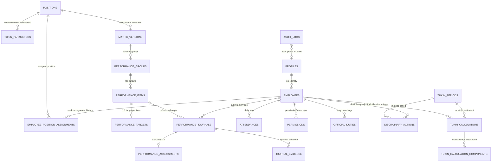

# IMPLEMENTATION SPECIFICATION FINAL V3.2.2
— FINAL SQL-READINESS PATCH

Dokumen ini merupakan spesifikasi teknis pamungkas (*Final SQL-Readiness Patch*) yang mematangkan seluruh detail arsitektur basis data Supabase / PostgreSQL. Seluruh patch penyempurnaan diberi label **[FINAL SQL-READINESS PATCH]** dan dirancang agar dapat langsung diimplementasikan ke dalam berkas migrasi SQL tanpa menimbulkan ambiguitas atau celah keamanan.

---

## 1. Executive Summary
Spesifikasi V3.2.2 mengintegrasikan 8 patch penentu kesiapan SQL:
1. Penyesuaian semantik batas transaksi PostgreSQL Function (tanpa manual `BEGIN/COMMIT` di dalam PL/pgSQL).
2. Diferensiasi aktor audit (`USER` vs `SYSTEM`).
3. Penutupan mutlak hak `DELETE` langsung pada seluruh tabel master/historis oleh klien.
4. Definisi struktural lengkap tabel `permissions` dan `official_duties`.
5. Validasi rantai otoritatif (*validation chain*) pada pembuatan jurnal kinerja.
6. Penolakan kalkulasi atas mutasi jabatan di tengah periode (*fail-safe* kebijakan tertunda).
7. Cakupan eksplisit 20 tabel pada modul `audit_logs`.
8. Penegasan semantik `tukin_percentage`, `gross_tukin`, `adjustment_amount`, dan `final_tukin`.

Dokumen ini menjadi satu-satunya acuan teknis untuk fase **SQL Migration Design & Supabase Database Implementation**.

---

## 2. Updated ERD (Entity Relationship Diagram) **[FINAL SQL-READINESS PATCH]**



---

## 3. Complete Table Definitions **[FINAL SQL-READINESS PATCH]**

Seluruh *Primary Key* menggunakan `UUID` default `uuid_generate_v4()`.

1. **`profiles`**: `id` (uuid, PK ref auth.users), `role` (varchar: 'admin' | 'user'), `full_name` (varchar), `created_at` (timestamptz), `updated_at` (timestamptz).
2. **`positions`**: `id` (uuid, PK), `name` (varchar, UNIQUE), `is_pamong_tukin_eligible` (boolean default false), `created_at`, `updated_at`.
3. **`employees`**: `id` (uuid, PK), `profile_id` (uuid, FK profiles.id, RESTRICT, UNIQUE), `nip_nipt` (varchar, nullable), `created_at`, `updated_at`.
4. **`employee_position_assignments`**: `id` (uuid, PK), `employee_id` (uuid, FK employees.id, RESTRICT), `position_id` (uuid, FK positions.id, RESTRICT), `status` (varchar: 'active' | 'inactive'), `effective_from` (date), `effective_to` (date, nullable), `created_at`, `updated_at`.
5. **`village_settings`**: `id` (uuid, PK), `setting_key` (varchar, UNIQUE), `setting_value` (jsonb), `created_at`, `updated_at`.
6. **`tukin_parameters`**: `id` (uuid, PK), `position_id` (uuid, FK positions.id, RESTRICT), `min_ckb_target` (int), `pagu_tukin` (numeric(15,2)), `effective_from` (date), `effective_to` (date, nullable), `created_at`, `updated_at`.
7. **`matrix_versions`**: `id` (uuid, PK), `position_id` (uuid, FK positions.id, RESTRICT), `version_number` (int), `status` (varchar: 'Draft' | 'Review' | 'Published' | 'Locked'), `effective_from` (date, nullable), `effective_to` (date, nullable), `created_at`, `updated_at`.
8. **`performance_groups`**: `id` (uuid, PK), `matrix_version_id` (uuid, FK matrix_versions.id, RESTRICT), `name` (varchar), `order_number` (int), `created_at`, `updated_at`.
9. **`performance_items`**: `id` (uuid, PK), `group_id` (uuid, FK performance_groups.id, RESTRICT), `name` (text), `unit` (varchar), `order_number` (int), `created_at`, `updated_at`.
10. **`performance_targets`**: `id` (uuid, PK), `item_id` (uuid, FK performance_items.id, RESTRICT, UNIQUE), `annual_target` (int), `monthly_target` (int), `created_at`, `updated_at`.
11. **`attendances`**: `id` (uuid, PK), `employee_id` (uuid, FK employees.id, RESTRICT), `attendance_date` (date), `check_in` (timestamptz, nullable), `check_out` (timestamptz, nullable), `status` (varchar), `note` (text, nullable), `created_at`, `updated_at`.
12. **`permissions`** **[FINAL SQL-READINESS PATCH]**: `id` (uuid, PK), `employee_id` (uuid, FK employees.id, RESTRICT), `start_date` (date), `end_date` (date), `permission_type` (varchar: 'cuti' | 'izin' | 'sakit' | 'lainnya'), `reason` (text), `status` (varchar: 'Draft' | 'Submitted' | 'Approved' | 'Rejected'), `approved_by` (uuid, FK profiles.id, RESTRICT, nullable), `approved_at` (timestamptz, nullable), `evidence_url` (text, nullable), `created_at`, `updated_at`.
13. **`official_duties`** **[FINAL SQL-READINESS PATCH]**: `id` (uuid, PK), `employee_id` (uuid, FK employees.id, RESTRICT), `start_date` (date), `end_date` (date), `duty_type` (varchar), `destination` (varchar), `purpose` (text), `status` (varchar: 'Draft' | 'Submitted' | 'Approved' | 'Rejected'), `approved_by` (uuid, FK profiles.id, RESTRICT, nullable), `approved_at` (timestamptz, nullable), `document_reference` (varchar, nullable), `created_at`, `updated_at`.
14. **`performance_journals`**: `id` (uuid, PK), `employee_id` (uuid, FK employees.id, RESTRICT), `item_id` (uuid, FK performance_items.id, RESTRICT), `activity_date` (date), `start_time` (time), `end_time` (time), `matrix_version_id_snapshot` (uuid), `group_name_snapshot` (varchar), `item_name_snapshot` (text), `target_snapshot` (int), `unit_snapshot` (varchar), `realization` (int), `location` (varchar), `note` (text, nullable), `return_reason` (text, nullable), `status` (varchar: 'Draft' | 'Submitted' | 'Verified' | 'Returned' | 'Approved' | 'Locked'), `created_at`, `updated_at`.
15. **`performance_assessments`**: `id` (uuid, PK), `journal_id` (uuid, FK performance_journals.id, RESTRICT, UNIQUE), `assessed_realization` (int), `capaian_value` (numeric(8,4)), `assessment_note` (text, nullable), `assessed_by` (uuid, FK profiles.id, RESTRICT), `assessed_at` (timestamptz), `created_at`, `updated_at`.
16. **`journal_evidence`**: `id` (uuid, PK), `journal_id` (uuid, FK performance_journals.id, CASCADE), `file_url` (text), `file_name` (varchar), `file_size` (bigint), `mime_type` (varchar), `created_at`.
17. **`disciplinary_actions`**: `id` (uuid, PK), `employee_id` (uuid, FK employees.id, RESTRICT), `period_id` (uuid, FK tukin_periods.id, RESTRICT), `adjustment_type` (varchar: 'Report Lateness' | 'Verbal Warning' | 'Written Warning I' | 'Written Warning II' | 'Written Warning III'), `adjustment_percentage` (numeric(5,2)), `source_rule` (varchar), `reason` (text), `document_reference` (varchar), `issued_by` (uuid, FK profiles.id, RESTRICT), `issued_at` (timestamptz), `created_at`, `updated_at`.
18. **`tukin_periods`**: `id` (uuid, PK), `period_month` (date, UNIQUE), `status` (varchar: 'Draft' | 'Locked'), `locked_at` (timestamptz, nullable), `locked_by` (uuid, FK profiles.id, RESTRICT, nullable), `created_at`, `updated_at`.
19. **`tukin_calculations`** **[FINAL SQL-READINESS PATCH]**: `id` (uuid, PK), `period_id` (uuid, FK tukin_periods.id, RESTRICT), `employee_id` (uuid, FK employees.id, RESTRICT), `tukin_formula_role` (varchar: 'Pamong' | 'Lurah'), `lurah_average_eligible` (boolean), `position_id_snapshot` (uuid), `pagu_snapshot` (numeric(15,2)), `min_ckb_snapshot` (int), `formula_version` (varchar), `attendance_policy_version` (varchar), `mk` (int), `hk` (int), `pb` (numeric(8,4)), `ckb` (numeric(8,4)), `tkb` (int), `actual_kb` (numeric(8,4)), `kb_used_for_npk` (numeric(8,4)), `npk` (numeric(8,4)), `tukin_percentage` (numeric(5,2)), `gross_tukin` (numeric(15,2)), `adjustment_amount` (numeric(15,2)), `final_tukin` (numeric(15,2)), `created_at`, `updated_at`.
20. **`tukin_calculation_components`**: `id` (uuid, PK), `lurah_calculation_id` (uuid, FK tukin_calculations.id, RESTRICT), `source_employee_id` (uuid, FK employees.id, RESTRICT), `source_percentage_snapshot` (numeric(5,2)), `created_at`.
21. **`audit_logs`** **[FINAL SQL-READINESS PATCH]**: `id` (uuid, PK), `actor_type` (varchar: 'USER' | 'SYSTEM'), `actor_profile_id` (uuid, FK profiles.id, RESTRICT, nullable), `action` (varchar: 'INSERT' | 'UPDATE' | 'DELETE' | 'STATE_TRANSITION'), `entity_type` (varchar), `entity_id` (uuid), `before_snapshot` (jsonb, nullable), `after_snapshot` (jsonb, nullable), `created_at` (timestamptz default now()).

---

## 4. Historical Integrity & Master Delete Protection **[FINAL SQL-READINESS PATCH]**
- **Client Direct DELETE = DENY**: Pada seluruh tabel master historis (`profiles`, `employees`, `positions`, `employee_position_assignments`, `tukin_parameters`, `matrix_versions`, `performance_groups`, `performance_items`, `performance_targets`), hak `DELETE` ditutup mutlak dari klien via RLS.
- **Controlled Draft Removal**: Hanya draf matriks (`status = 'Draft'`) yang belum pernah memiliki referensi jurnal yang dapat dibersihkan melalui fungsi administratif khusus, bukan via `DELETE` bebas.
- **Published & Locked = IMMUTABLE**: Matriks dan parameter berstatus *Published* atau *Locked* tidak dapat diubah oleh peran apa pun.

---

## 5. Employee Assignment Integrity **[FINAL SQL-READINESS PATCH]**
- Satu pegawai maksimal hanya memiliki **satu penugasan aktif** (`status = 'active'`) pada rentang tanggal tertentu: `[effective_from, effective_to)`.
- Menggunakan constraint exclusion GiST daterange:
  `EXCLUDE USING gist (employee_id WITH =, daterange(effective_from, coalesce(effective_to, 'infinity'::date), '[)') WITH &&) WHERE (status = 'active')`.
- `CHECK (effective_to IS NULL OR effective_to > effective_from)`.

---

## 6. Matrix & Parameter Versioning **[FINAL SQL-READINESS PATCH]**
- Rentang waktu half-open `[effective_from, effective_to)`. `effective_to = NULL` berarti berlaku terbuka hingga diterbitkannya versi berikutnya.
- **Matrix Published Uniqueness**:
  `EXCLUDE USING gist (position_id WITH =, daterange(effective_from, coalesce(effective_to, 'infinity'::date), '[)') WITH &&) WHERE (status = 'Published')`.
- **Tukin Parameter Uniqueness**:
  `EXCLUDE USING gist (position_id WITH =, daterange(effective_from, coalesce(effective_to, 'infinity'::date), '[)') WITH &&)`.
- Jurnal kinerja mengunci versi matriks yang aktif pada `activity_date` tersebut.

---

## 7. Attendance Architecture **[FINAL SQL-READINESS PATCH]**
- Modul waktu (`attendances`, `permissions`, `official_duties`) bertindak murni sebagai penyedia data log faktual.
- Evaluasi nilai `MK` (Masuk Kerja) dan `HK` (Hari Kerja) dieksekusi secara terisolasi oleh mesin kalkulasi berdasarkan `attendance_policy_version`.

---

## 8. Journal Validation Chain **[FINAL SQL-READINESS PATCH]**
Ketika jurnal dibuat atau diajukan (`submit_journal`), basis data/RPC wajib memvalidasi rantai otoritatif penuh:
$$\text{auth.uid()} \rightarrow \text{profile} \rightarrow \text{employee} \rightarrow \text{active assignment} \rightarrow \text{position} \rightarrow \text{published matrix} \rightarrow \text{group} \rightarrow \text{item} \rightarrow \text{target}$$

Validasi mencakup:
1. `employee_id` terikat langsung dengan `auth.uid()`.
2. Pegawai memiliki penugasan posisi berstatus `'active'` pada `activity_date`.
3. `item_id` benar-benar anak dari `performance_groups` dalam `matrix_versions` berstatus `'Published'` milik posisi pegawai tersebut.
4. `matrix_versions.effective_from <= activity_date` dan (`effective_to IS NULL` atau `activity_date < effective_to`).
5. Seluruh field snapshot (`matrix_version_id_snapshot`, `group_name_snapshot`, `item_name_snapshot`, `target_snapshot`, `unit_snapshot`) diisi otomatis oleh kueri internal basis data, **BUKAN** dari kiriman payload frontend.

---

## 9. Journal State Machine & Transitions **[FINAL SQL-READINESS PATCH]**

```
None ──(Pamong create)──> Draft
Draft / Returned ──(Pamong submit_journal)──> Submitted
Submitted ──(Carik verify_journal)──> Verified
Submitted ──(Carik return_journal + reason)──> Returned
Verified ──(Lurah return_journal + reason)──> Returned
Verified ──(Lurah approve_journal + assessment)──> Approved
Approved ──(System generate_calculations)──> Locked
```

- Seluruh transisi mutlak dieksekusi melalui RPC Server. Klien dilarang melakukan `UPDATE status` secara langsung.
- Status `Approved` tidak dapat kembali menjadi `Draft` atau `Returned`.
- Status `Locked` bersifat permanen dan tidak dapat diubah oleh siapa pun.

---

## 10. Assessment Authorization **[FINAL SQL-READINESS PATCH]**
Pada saat `approve_journal(journal_id, assessed_realization, capaian_value, assessment_note)`:
- Database memeriksa `auth.uid()` $\rightarrow$ `profile` $\rightarrow$ `employee` $\rightarrow$ aktif memegang `position.name = 'Lurah'` pada tanggal transaksi.
- Parameter `assessed_by` otomatis disuntikkan dari profil Lurah hasil kueri server, menolak nilai apa pun yang dikirim klien.

---

## 11. Evidence Security **[FINAL SQL-READINESS PATCH]**
- Relasi `journal_evidence` ke `performance_journals` menggunakan `ON DELETE CASCADE` hanya sah selama jurnal berstatus `'Draft'` atau `'Returned'`.
- Setelah jurnal berstatus `'Submitted'`, `'Verified'`, `'Approved'`, atau `'Locked'`, kebijakan RLS memblokir operasi `INSERT`, `UPDATE`, dan `DELETE` pada tabel `journal_evidence`.

---

## 12. Disciplinary Architecture & Semantics **[FINAL SQL-READINESS PATCH]**
Pemisahan tegas jenis sanksi:
- **Report Lateness**: Potongan tetap 5% dari hak Tukin.
- **Disciplinary Warning**:
  - Peringatan Lisan: 20%
  - Peringatan Tertulis I: 25%
  - Peringatan Tertulis II: 30%
  - Peringatan Tertulis III: 35%

Nilai persentase potongan dicatat pada `disciplinary_actions.adjustment_percentage`. Nilai uang potongannya dicatat sebagai snapshot pada `tukin_calculations.adjustment_amount`.

---

## 13. Calculation Architecture & Semantics **[FINAL SQL-READINESS PATCH]**
Alur penurunan nilai Tukin Pamong:
1. $\text{NPK} = (\text{PB} \times 40) + (\text{KB} \times 60)$
2. Pemetaan interval NPK $\rightarrow$ `tukin_percentage`:
   - $91 \le \text{NPK} \le 100 \rightarrow 100\%$
   - $81 \le \text{NPK} < 91 \rightarrow 90\%$
   - $71 \le \text{NPK} < 81 \rightarrow 70\%$
   - $40 \le \text{NPK} < 71 \rightarrow 40\%$
   - $10 \le \text{NPK} < 40 \rightarrow 10\%$
   - $0 \le \text{NPK} < 10 \rightarrow 0\%$
3. $\text{gross\_tukin} = \text{pagu\_snapshot} \times (\text{tukin\_percentage} / 100)$
4. $\text{adjustment\_amount} = \text{gross\_tukin} \times (\sum \text{adjustment\_percentage} / 100)$
5. $\text{final\_tukin} = \text{gross\_tukin} - \text{adjustment\_amount}$

---

## 14. Lurah Calculation Audit Trail **[FINAL SQL-READINESS PATCH]**
Formula Tukin Lurah:
$$\text{Tukin Lurah} = \text{average\_eligible\_percentage} \times \text{pagu\_snapshot Lurah}$$

- Populasi pembentuk rata-rata: Pegawai aktif dengan penugasan posisi Carik, Kaur, Kasi, Dukuh pada periode tersebut (`lurah_average_eligible = true`).
- Setiap pamong yang berkontribusi dicatat ke dalam tabel `tukin_calculation_components` (`lurah_calculation_id`, `source_employee_id`, `source_percentage_snapshot`).

---

## 15. Formula Version Abstraction
Field `formula_version` mengikat konfigurasi:
- Bobot PB 40% dan KB 60%.
- Formula CKB & KB.
- Perilaku Capping KB (kebijakan tertunda).
- Penanganan NPK desimal (kebijakan tertunda).
- Pemetaan persentase Tukin regulasi.

---

## 16. Attendance Policy Version Abstraction
Field `attendance_policy_version` mengikat aturan konversi kehadiran:
- Perhitungan hari kerja efektif (HK).
- Perhitungan masuk kerja (MK) dari absensi, cuti, izin, sakit, dan dinas luar (kebijakan tertunda).

---

## 17. Employee Mutation Policy (Tengah Periode) **[FINAL SQL-READINESS PATCH]**
- **Status Kebijakan**: *DEFERRED BUSINESS POLICY*.
- **Fail-Safe Mechanism**: Fungsi `generate_calculations(period_id)` **WAJIB MENOLAK** dan melempar eksepsi transaksi jika ditemukan pegawai yang memiliki lebih dari satu penugasan aktif relevan pada periode bulan tersebut.
- Pesan kesalahan standar: *"Periode tidak dapat dikalkulasi karena terdapat mutasi jabatan dalam periode berjalan. Tetapkan kebijakan mutasi jabatan terlebih dahulu."*

---

## 18. Audit Log Architecture **[FINAL SQL-READINESS PATCH]**

### A. Cakupan Eksplisit 20 Entitas
1. `profiles`
2. `employees`
3. `positions`
4. `employee_position_assignments`
5. `village_settings`
6. `tukin_parameters`
7. `matrix_versions`
8. `performance_groups`
9. `performance_items`
10. `performance_targets`
11. `attendances`
12. `permissions`
13. `official_duties`
14. `performance_journals`
15. `performance_assessments`
16. `journal_evidence`
17. `disciplinary_actions`
18. `tukin_periods`
19. `tukin_calculations`
20. `tukin_calculation_components`

### B. Aturan Aktor & Integritas
- `actor_type = 'USER'`: Wajib disertai `actor_profile_id NOT NULL` yang diekstrak dari konteks sesi terotentikasi.
- `actor_type = 'SYSTEM'`: Wajib `actor_profile_id IS NULL` (digunakan untuk eksekusi terjadwal/CRON/internal engine).
- CHECK Constraint: `CHECK ((actor_type = 'USER' AND actor_profile_id IS NOT NULL) OR (actor_type = 'SYSTEM' AND actor_profile_id IS NULL))`.
- Client `INSERT`, `UPDATE`, `DELETE` = **DENY**. Pencatatan hanya melalui pemicu (*PostgreSQL Trigger*) dan RPC terpercaya.
- Pemicu audit dirancang aman dari *recursive loop*.

---

## 19. RLS Operation Matrix Final **[FINAL SQL-READINESS PATCH]**

| Tabel / Domain | Pamong (User) | Carik (Admin) | Lurah (Evaluator) | Trusted System / RPC |
|---|---|---|---|---|
| `profiles` | SELECT (Self) | SELECT (All)<br>INSERT, UPDATE (Admin)<br>DELETE = **DENY** | SELECT (All)<br>DELETE = **DENY** | SELECT, INSERT, UPDATE, DELETE |
| `employees` | SELECT (Self) | SELECT (All)<br>INSERT, UPDATE (Admin)<br>DELETE = **DENY** | SELECT (All)<br>DELETE = **DENY** | SELECT, INSERT, UPDATE, DELETE |
| `positions` | SELECT (All) | SELECT (All)<br>INSERT, UPDATE (Admin)<br>DELETE = **DENY** | SELECT (All)<br>DELETE = **DENY** | SELECT, INSERT, UPDATE, DELETE |
| `employee_position_assignments` | SELECT (Self) | SELECT (All)<br>INSERT, UPDATE (Admin)<br>DELETE = **DENY** | SELECT (All)<br>DELETE = **DENY** | SELECT, INSERT, UPDATE, DELETE |
| `village_settings` | SELECT (All) | SELECT, UPDATE (Admin)<br>DELETE = **DENY** | SELECT (All)<br>DELETE = **DENY** | SELECT, UPDATE |
| `tukin_parameters` | SELECT (All) | SELECT (All)<br>INSERT, UPDATE (Admin)<br>DELETE = **DENY** | SELECT (All)<br>DELETE = **DENY** | SELECT, INSERT, UPDATE, DELETE |
| `matrix_versions` (+ groups, items, targets) | SELECT (Published/Locked) | SELECT (All)<br>INSERT, UPDATE (Draft only)<br>DELETE = **DENY** | SELECT (All)<br>DELETE = **DENY** | SELECT, INSERT, UPDATE, DELETE |
| `attendances` | SELECT, INSERT, UPDATE (Self) | SELECT, INSERT, UPDATE (All)<br>DELETE = **DENY** | SELECT (All)<br>DELETE = **DENY** | SELECT, INSERT, UPDATE, DELETE |
| `permissions`, `official_duties` | SELECT, INSERT, UPDATE (Self, Draft)<br>DELETE (Self, Draft) | SELECT (All)<br>UPDATE (Admin review)<br>DELETE = **DENY** | SELECT (All)<br>UPDATE (Lurah approval)<br>DELETE = **DENY** | SELECT, INSERT, UPDATE, DELETE |
| `performance_journals` | SELECT (Self)<br>INSERT (Self, Draft)<br>UPDATE (Self, Draft/Returned)<br>DELETE (Self, Draft) | SELECT (All)<br>INSERT, UPDATE, DELETE = **DENY** (via RPC verify) | SELECT (All)<br>INSERT, UPDATE, DELETE = **DENY** (via RPC approve) | SELECT, INSERT, UPDATE, DELETE |
| `journal_evidence` | SELECT (Self)<br>INSERT (Self, Draft/Ret)<br>DELETE (Self, Draft/Ret) | SELECT (All)<br>INSERT, UPDATE, DELETE = **DENY** | SELECT (All)<br>INSERT, UPDATE, DELETE = **DENY** | SELECT, INSERT, UPDATE, DELETE |
| `performance_assessments` | SELECT (Self) | SELECT (All)<br>INSERT, UPDATE, DELETE = **DENY** | SELECT (All)<br>INSERT, UPDATE = **DENY** (via RPC approve) | SELECT, INSERT, UPDATE, DELETE |
| `disciplinary_actions` | SELECT (Self) | SELECT (All)<br>INSERT, UPDATE (Admin)<br>DELETE = **DENY** | SELECT (All)<br>DELETE = **DENY** | SELECT, INSERT, UPDATE, DELETE |
| `tukin_periods` | SELECT (All) | SELECT (All)<br>INSERT (Draft)<br>DELETE = **DENY** | SELECT (All)<br>DELETE = **DENY** | SELECT, INSERT, UPDATE, DELETE |
| `tukin_calculations`, `calculation_components` | SELECT (Self) | SELECT (All)<br>INSERT, UPDATE, DELETE = **DENY** | SELECT (All)<br>INSERT, UPDATE, DELETE = **DENY** | SELECT, INSERT, UPDATE, DELETE |
| `audit_logs` | SELECT (Milik sendiri) | SELECT (All)<br>INSERT, UPDATE, DELETE = **DENY** | SELECT (All)<br>INSERT, UPDATE, DELETE = **DENY** | **INSERT ONLY** via Trigger/RPC |

---

## 20. RPC Authorization Matrix **[FINAL SQL-READINESS PATCH]**
Seluruh RPC didefinisikan dengan atribut `SECURITY DEFINER` dan `SET search_path = public, pg_temp`:

1. `submit_journal(p_journal_id uuid)`:
   - Validasi: `auth.uid()` adalah pemilik jurnal; status jurnal saat ini `'Draft'` atau `'Returned'`.
   - Aksi: Menjalankan *Journal Validation Chain*; mengisi field snapshot dari database; mengubah status menjadi `'Submitted'`.
2. `return_journal(p_journal_id uuid, p_reason text)`:
   - Validasi:
     - Jika status `'Submitted'`: Pemanggil harus terotentikasi sebagai Carik (`role = 'admin'` dan penugasan aktif Carik).
     - Jika status `'Verified'`: Pemanggil harus terotentikasi sebagai Lurah (penugasan aktif Lurah).
   - Aksi: Mengisi `return_reason`; mengubah status menjadi `'Returned'`.
3. `verify_journal(p_journal_id uuid)`:
   - Validasi: Pemanggil terotentikasi sebagai Carik; status jurnal `'Submitted'`.
   - Aksi: Mengubah status menjadi `'Verified'`.
4. `approve_journal(p_journal_id uuid, p_assessed_realization int, p_capaian_value numeric, p_note text)`:
   - Validasi: Pemanggil terotentikasi sebagai Lurah; status jurnal `'Verified'`.
   - Aksi: Membuat/memperbarui rekaman `performance_assessments` dengan `assessed_by` dari profil Lurah; mengubah status jurnal menjadi `'Approved'`.
5. `publish_matrix_version(p_matrix_version_id uuid)`:
   - Validasi: Pemanggil terotentikasi sebagai Lurah; status matriks `'Review'`.
   - Aksi: Mengubah status menjadi `'Published'`.
6. `generate_calculations(p_period_id uuid)`:
   - Validasi: Pemanggil terotentikasi sebagai Carik atau trusted system; status periode `'Draft'`.
   - Aksi: Menjalankan transaksi atomik kalkulasi.

---

## 21. Atomic Transaction Specification (`generate_calculations`) **[FINAL SQL-READINESS PATCH]**
Sesuai arsitektur PostgreSQL, seluruh logika prosedur berjalan dalam transaksi bawaan pemanggilan fungsi (tanpa menulis `BEGIN/COMMIT/ROLLBACK` secara manual di kode PL/pgSQL). Setiap eksepsi otomatis memicu *rollback* basis data secara menyeluruh.

```
FUNGSI generate_calculations(p_period_id uuid) RETURNS void AS $$
1. Identifikasi pemanggil:
   - Pastikan auth.uid() adalah Carik aktif ATAU pemanggilan berstatus SYSTEM.
2. Row-Level Lock & Idempotency:
   - SELECT * FROM tukin_periods WHERE id = p_period_id FOR UPDATE;
   - Pastikan row ditemukan dan status = 'Draft'. Jika 'Locked', raise exception (tolak eksekusi ulang).
3. Validasi Pra-Kalkulasi:
   - Pastikan tidak ada pegawai aktif dengan mutasi jabatan ganda di periode ini (Patch 06).
   - Pastikan parameter Tukin, matriks aktif, dan aturan absensi valid untuk bulan tersebut.
4. Perhitungan Pamong (Carik, Kaur, Kasi, Dukuh):
   - Ambil seluruh jurnal berstatus 'Approved' dalam bulan tersebut.
   - Ambil rekap absensi & hitung PB.
   - Hitung CKB, KB, NPK, tukin_percentage, gross_tukin.
   - Perhitungkan sanksi/keterlambatan -> hitung adjustment_amount dan final_tukin.
   - Tampung hasil di memori kalkulasi sementara.
5. Perhitungan Lurah:
   - Hitung average_eligible_percentage dari seluruh Pamong eligible hasil langkah 4.
   - Hitung gross_tukin Lurah = average_eligible_percentage * pagu Lurah.
   - Perhitungkan sanksi Lurah jika ada -> final_tukin Lurah.
6. Validasi Pasca-Kalkulasi:
   - Pastikan tidak ada nilai kalkulasi yang NaN, null, atau tidak logis.
7. Penulisan Basis Data:
   - INSERT seluruh baris kalkulasi ke tukin_calculations.
   - INSERT seluruh rincian pamong kontributor Lurah ke tukin_calculation_components.
   - UPDATE performance_journals SET status = 'Locked' WHERE id IN (jurnal yang dihitung).
   - UPDATE tukin_periods SET status = 'Locked', locked_at = now(), locked_by = auth.uid() WHERE id = p_period_id;
8. Audit Event:
   - Panggil pencatatan audit log untuk entitas tukin_periods (action: 'STATE_TRANSITION', status: 'Locked').
9. Selesai (Database secara otomatis melakukan COMMIT saat fungsi keluar tanpa eksepsi).
$$;
```

---

## 22. Storage Security **[FINAL SQL-READINESS PATCH]**
- **Bucket**: `evidence` (Private).
- **Struktur Path**: `evidence/{employee_id}/{YYYY-MM}/{uuid}.ext`.
- **Kebijakan Supabase Storage**:
  - `SELECT`: Pemilik bukti (`employee_id`), Carik (seluruhnya), dan Lurah (seluruhnya).
  - `INSERT`: Hanya pegawai pemilik yang status jurnalnya masih `'Draft'` atau `'Returned'`.
  - `UPDATE`: **DENY** untuk semua pihak.
  - `DELETE`: Hanya pegawai pemilik yang status jurnalnya masih `'Draft'` atau `'Returned'`.
  - File menjadi absolut tidak dapat diubah setelah jurnal diajukan (`'Submitted'`).

---

## 23. Complete Constraints Summary **[FINAL SQL-READINESS PATCH]**

### UNIQUE
- `positions(name)`
- `employees(profile_id)`
- `performance_targets(item_id)`
- `attendances(employee_id, attendance_date)`
- `performance_assessments(journal_id)`
- `tukin_periods(period_month)`
- `tukin_calculations(period_id, employee_id)`
- `matrix_versions(position_id, version_number)`

### CHECK
- `tukin_periods`: `CHECK (date_trunc('month', period_month) = period_month)` (Hari pertama awal bulan).
- `tukin_periods`: `CHECK (status IN ('Draft', 'Locked'))`.
- `performance_journals`: `CHECK (start_time < end_time)`.
- `performance_journals`: `CHECK (status IN ('Draft', 'Submitted', 'Verified', 'Returned', 'Approved', 'Locked'))`.
- `employee_position_assignments`: `CHECK (effective_to IS NULL OR effective_to > effective_from)`.
- `employee_position_assignments`: `CHECK (status IN ('active', 'inactive'))`.
- `tukin_parameters`: `CHECK (effective_to IS NULL OR effective_to > effective_from)`.
- `tukin_parameters`: `CHECK (pagu_tukin >= 0 AND min_ckb_target >= 0)`.
- `audit_logs`: `CHECK ((actor_type = 'USER' AND actor_profile_id IS NOT NULL) OR (actor_type = 'SYSTEM' AND actor_profile_id IS NULL))`.
- `tukin_calculations`: `CHECK (tukin_percentage >= 0 AND gross_tukin >= 0 AND final_tukin >= 0)`.

### GiST Exclusion
- `performance_journals`: Pencegahan tumpang-tindih jam kerja di tanggal yang sama untuk pegawai yang sama:
  `EXCLUDE USING gist (employee_id WITH =, tsrange((activity_date + start_time)::timestamp, (activity_date + end_time)::timestamp, '[)') WITH &&)`.
- `employee_position_assignments`: Pencegahan posisi aktif ganda di tanggal yang sama:
  `EXCLUDE USING gist (employee_id WITH =, daterange(effective_from, coalesce(effective_to, 'infinity'::date), '[)') WITH &&) WHERE (status = 'active')`.
- `tukin_parameters`: Pencegahan tumpang-tindih parameter posisi:
  `EXCLUDE USING gist (position_id WITH =, daterange(effective_from, coalesce(effective_to, 'infinity'::date), '[)') WITH &&)`.
- `matrix_versions`: Pencegahan matriks Published ganda untuk posisi yang sama:
  `EXCLUDE USING gist (position_id WITH =, daterange(effective_from, coalesce(effective_to, 'infinity'::date), '[)') WITH &&) WHERE (status = 'Published')`.

---

## 24. Index Strategy
- `idx_emp_pos_assign_lookup`: `employee_position_assignments(employee_id, status, effective_from, effective_to)`.
- `idx_journal_lookup`: `performance_journals(employee_id, activity_date, status)`.
- `idx_attendance_lookup`: `attendances(employee_id, attendance_date)`.
- `idx_calc_lookup`: `tukin_calculations(period_id, employee_id)`.
- `idx_audit_lookup`: `audit_logs(entity_type, entity_id, created_at)`.

---

## 25. Migration Order **[FINAL SQL-READINESS PATCH]**
Urutan berkas migrasi SQL yang mematuhi dependensi integritas referensial:
1. `001_extensions_and_types.sql`: Ekstensi `uuid-ossp`, `btree_gist`.
2. `002_core_auth.sql`: Tabel `profiles`, `positions`, `employees`.
3. `003_employee_assignments.sql`: Tabel `employee_position_assignments` + GiST constraint.
4. `004_village_settings.sql`: Tabel `village_settings`.
5. `005_tukin_parameters.sql`: Tabel `tukin_parameters` + GiST constraint.
6. `006_performance_matrix.sql`: Tabel `matrix_versions`, `performance_groups`, `performance_items`, `performance_targets`.
7. `007_attendance_modules.sql`: Tabel `attendances`, `permissions`, `official_duties`.
8. `008_journals_and_evidence.sql`: Tabel `performance_journals`, `performance_assessments`, `journal_evidence`.
9. `009_disciplinary_actions.sql`: Tabel `disciplinary_actions`.
10. `010_tukin_calculations.sql`: Tabel `tukin_periods`, `tukin_calculations`, `tukin_calculation_components`.
11. `011_audit_logging.sql`: Tabel `audit_logs`, fungsi audit trigger, dan pemasangan pemicu ke 20 tabel.
12. `012_storage_security.sql`: Pembuatan bucket `evidence` dan kebijakan storage.
13. `013_rls_policies.sql`: Penerapan RLS lengkap pada seluruh 20 tabel.
14. `014_rpc_functions.sql`: Fungsi `submit_journal`, `verify_journal`, `return_journal`, `approve_journal`, `publish_matrix_version`, `generate_calculations`.
15. `015_seed_kalidengen.sql`: Data awal Kalurahan Kalidengen (8 jabatan, 10 pamong definitif, parameter, template matriks).

---

## 26. Seed Requirements (Kalidengen)
- **Jabatan Resmi (8)**: Lurah, Carik, Danarta, Panata Laksana Sarta Pangripta (Palapa), Jagabaya, Ulu-Ulu, Kamituwa, Dukuh.
- **Pegawai Definitif (10)**:
  1. Sunardi (Lurah)
  2. Muh. Masruri Mustofa (Carik)
  3. Viki Wulandari (Danarta)
  4. Agus Endarto (Palapa)
  5. Subarno (Jagabaya)
  6. Saridi (Ulu-Ulu)
  7. Sumardi (Kamituwa)
  8. Widi Hartono (Dukuh Kalidengen I)
  9. Rendi Ardiyanto (Dukuh Kalidengen II)
  10. Edi Supriyanto (Dukuh Sidatan)
- **Aturan Matriks Dukuh**: Tiga dukuh menggunakan satu template matriks yang sama.
- **Staf**: Template matriks disimpan, tidak ada pegawai staf aktif yang di-seed.
- **Bamuskal**: **TOTAL OUT OF SCOPE** (Dilarang ada data Bamuskal di berkas seed apa pun).

---

## 27. Deferred Business Decisions (Do Not Change)
Tetap ditandai sebagai kebijakan tertunda dan diisolasi via layer abstraksi:
1. **KB Capping > 100%**: Normalisasi batas maksimum kinerja.
2. **Partial Output Achievement**: Mekanisme pembobotan capaian bila realisasi di bawah target.
3. **NPK Rounding**: Aturan pembulatan desimal nilai NPK.
4. **Valid MK/HK Treatment**: Ekuivalensi cuti, izin, sakit, dan dinas luar terhadap hari masuk kerja.
5. **Mutasi Jabatan di Tengah Periode**: Mekanisme kalkulasi Tukin jika pamong berpindah posisi di tengah bulan.

---

## 28. Final SQL Readiness Checklist

| Patch / Kategori Audit | Status Implementasi | Bagian Dokumen | Hasil |
|---|---|---|---|
| PATCH 01 — PostgreSQL Transaction Boundary | Diterapkan: Atomik via PL/pgSQL, Row Lock, Auto-Rollback | Section 21 | CLOSED |
| PATCH 02 — Audit Actor User vs System | Diterapkan: `actor_type` ('USER'/'SYSTEM') + CHECK constraint | Section 3, 18 | CLOSED |
| PATCH 03 — Master Historis Tidak Boleh Direct Delete | Diterapkan: Client DELETE = DENY untuk 9 tabel master | Section 4, 19 | CLOSED |
| PATCH 04 — Complete Permissions & Official Duties | Diterapkan: Definisi lengkap field dan relasi | Section 3, 7 | CLOSED |
| PATCH 05 — Validation Chain Journal | Diterapkan: Verifikasi rantai 9 tingkat dari auth.uid() | Section 8, 20 | CLOSED |
| PATCH 06 — Mutasi Jabatan di Tengah Periode | Diterapkan: Penolakan transaksi jika mutasi terdeteksi | Section 17, 21 | CLOSED |
| PATCH 07 — Audit Table Coverage | Diterapkan: Daftar eksplisit 20 tabel + trigger events | Section 18 | CLOSED |
| PATCH 08 — Tukin Percentage vs Final Tukin | Diterapkan: Semantik eksplisit gross, adjustment, final | Section 3, 13 | CLOSED |
| Konsistensi ERD $\leftrightarrow$ DDL $\leftrightarrow$ RLS $\leftrightarrow$ RPC | Tervalidasi menyeluruh tanpa konflik | Seluruh Bagian | CLOSED |

---

## FINAL READINESS CLASSIFICATION

- **DATABASE SCHEMA**: **READY**
- **SECURITY & RLS**: **READY**
- **HISTORICAL INTEGRITY**: **READY**
- **AUDIT TRAIL**: **READY**
- **STORAGE SECURITY**: **READY**
- **CALCULATION ENGINE**: **READY / POLICY PENDING**
- **BUSINESS RULE**: **DO NOT CHANGE**
- **SQL MIGRATION**: **READY FOR NEXT PHASE**

---
*Spesifikasi V3.2.2 telah selesai secara sempurna. Seluruh fondasi basis data terkunci, konsisten, dan siap diterjemahkan ke dalam kode migrasi SQL Supabase.*
