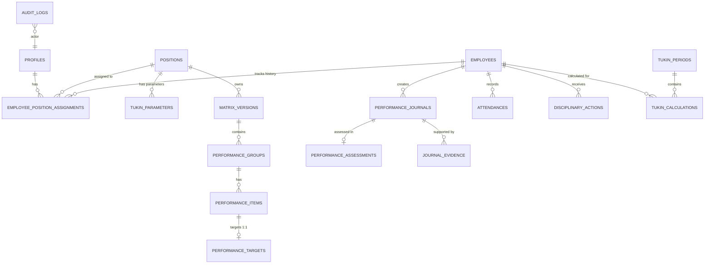

# IMPLEMENTATION SPECIFICATION FINAL V3.2
— DATABASE HARDENED / CALCULATION POLICY STILL PENDING

Dokumen ini merupakan pemutakhiran arsitektur teknis V3.1 dengan penambahan lapis pengerasan (*hardening*) mutlak pada *audit trail*, integritas relasi masa lalu (*historical integrity*), transisi *state machine* melalui RPC, serta abstraksi komponen formula yang belum diputuskan secara final. Tidak ada asumsi bisnis baru maupun modifikasi atas formula yang telah disepakati. Bamuskal tetap **OUT OF SCOPE**.

---

## 1. Executive Summary
Spesifikasi V3.2 mengunci seluruh celah keamanan dari sisi *Database Schema* dan *Row Level Security* (RLS). Setiap perubahan penting ditandai dengan **[HARDENING CHANGE]**. Dokumen ini secara definitif siap untuk dikonversi menjadi *SQL Migrations*, dengan pengecualian *Calculation Policy* (Kalkulasi CK.B, KB, MK) yang secara sengaja di-*defer* via fitur versi (abstraksi fungsional).

---

## 2. Updated ERD

---

## 3. Complete Table Definitions

1. **`profiles`**
   - `id` (uuid, PK, ref auth.users), `role` (varchar: 'admin', 'user'), `full_name` (varchar).
   - **[HARDENING CHANGE]**: *Role Frontend* dilarang jadi penentu otoritas mutlak. Otoritas diverifikasi dari kombinasi `role` dan `position` pada penugasan aktif.
2. **`positions`**
   - `id` (uuid, PK), `name` (varchar, UNIQUE), `is_pamong_tukin_eligible` (boolean).
3. **`employees`**
   - `id` (uuid, PK), `profile_id` (uuid, FK, UNIQUE 1:1), `nip_nipt` (varchar).
   - **[HARDENING CHANGE]**: `status` dan `position_id` di-*extract* ke tabel historis.
4. **`employee_position_assignments`** **[HARDENING CHANGE]**
   - `id` (uuid, PK), `employee_id` (FK), `position_id` (FK), `status` (varchar: active/inactive).
   - `effective_from` (date), `effective_to` (date, nullable). *(EXCLUDE OVERLAP)*.
5. **`tukin_parameters`**
   - `id` (PK), `position_id` (FK), `min_ckb_target` (int), `pagu_tukin` (numeric 15,2).
   - `effective_from` (date), `effective_to` (date). *(EXCLUDE OVERLAP)*.
6. **`matrix_versions`**
   - `id` (PK), `position_id` (FK), `version_number` (int, UNIQUE per position), `status` (varchar).
   - `effective_from` (date), `effective_to` (date). *(EXCLUDE OVERLAP if status=Published)*.
7. **`performance_groups`** / **`performance_items`** / **`performance_targets`**
   - **[HARDENING CHANGE]**: `UNIQUE(item_id)` di `performance_targets` untuk mencegah duplikasi aktif per item.
8. **`performance_journals`**
   - Hist. Snapshot: `matrix_version_id_snapshot`, `group_name_snapshot`, `item_name_snapshot`, `target_snapshot`, `unit_snapshot`.
9. **`performance_assessments`**
   - `journal_id` (FK, UNIQUE).
10. **`journal_evidence`**
    - `file_url` (text), `content_type` (varchar), `size` (int).
11. **`disciplinary_actions`**
    - `adjustment_type` (varchar: 'Report Lateness', 'Verbal Warning', 'Written Warning I/II/III').
12. **`tukin_periods`**
    - `period_month` (date). **[HARDENING CHANGE]** CHECK = tanggal pertama awal bulan (01).
13. **`tukin_calculations`**
    - `pagu_snapshot` (numeric 15,2), `actual_kb` (numeric 8,4), `kb_used_for_npk` (numeric 8,4), `tukin_percentage` (numeric 5,2), `final_tukin` (numeric 15,2).
14. **`audit_logs`** **[HARDENING CHANGE]**
    - `id` (PK), `actor_profile_id` (FK), `action` (varchar), `entity_type` (varchar), `entity_id` (uuid), `before_snapshot` (jsonb), `after_snapshot` (jsonb), `created_at` (timestamptz).

---

## 4. Historical Data Strategy & 5. Employee Position History
**[HARDENING CHANGE]**: Tabel `employee_position_assignments` diperkenalkan agar mutasi (perpindahan jabatan) seorang Pamong tidak merusak histori Tukin di masa lalu. Engine kalkulasi wajib menengok jabatan yang statusnya aktif pada `tukin_periods.period_month` tersebut, lalu menyalin ID tersebut ke `position_id_snapshot` di `tukin_calculations`.

## 6. Employee Active History
**[HARDENING CHANGE]**: Populasi pembagi / *eligible employees* dicari dari `employee_position_assignments.status = 'active'` yang beririsan dengan periode bulan kalkulasi.

## 7. Matrix Versioning & 8. Tukin Parameter Versioning
- **[HARDENING CHANGE]**: Rentang berlaku `[effective_from, effective_to)` dikunci via *GiST Daterange Exclusion Constraint*. Matrix dengan status `Published` tidak boleh saling bertindihan. Parameter untuk jabatan yang sama tidak boleh bertindihan. Jurnal baru harus mengunci *snapshot* ke versi yang valid di hari tersebut.

## 9. Attendance Architecture
- Modul Waktu tidak menentukan MK sendiri. Data diekstrak ke dalam Engine menggunakan `attendance_policy_version` untuk diolah.

## 10. Journal State Machine & 11. Assessment Authorization
**[HARDENING CHANGE]**: `assessed_by` tidak boleh dikirim dari klien. RPC `approve_journal()` mengekstrak otorisasi dari sesi `auth.uid()`, melacak `profile_id`, dan me-Validasi tabel `employee_position_assignments` apakah orang tersebut aktif memegang posisi **Lurah** di saat ini. Hanya Lurah yang bisa melakukan `Approve/Return` Jurnal *Verified*.

## 12. Evidence Security (Storage)
- **[HARDENING CHANGE]**: Supabase Storage Bucket. RLS Bucket: `INSERT` diizinkan saat Jurnal `Draft/Returned`. `UPDATE/DELETE` dilarang setelah Jurnal di-`Submit`. File historis murni immutable.

## 13. Disciplinary Architecture
- **[HARDENING CHANGE]**: Pemisahan jelas: `Report Lateness` vs `Warning I/II/III`. Potongan direkam dalam bentuk pecahan desimal (`adjustment_percentage`) dari tabel Master Perdes lalu disalin utuh saat kalkulasi.

## 14. Tukin Calculation Architecture & 15. Lurah Calculation Audit
- Snapshot komponen audit Lurah: `eligible_count`, `eligible_percentage_sum`, `average_eligible_percentage` di-injeksi di tabel Tukin Lurah. Populasi Carik, Kaur, Kasi, Dukuh ditarik dari *snapshot eligibility*. (Bamuskal/Lurah di-exclude absolut).

## 16. Formula Version & 17. Attendance Policy Version
- Kombinasi label spesifik, contoh: `FORMULA_V1.0_NO_CAPPING` dan `ATTENDANCE_V1.0_TOLERANCE_30`. Ini mewajibkan *Backend/RPC* memiliki sekumpulan *switch/case* strategi fungsional atas aturan bisnis yang tertunda.

## 18. RLS Operation Matrix
**[HARDENING CHANGE]**: 
- `performance_journals`: Pamong (S/I/U/D hanya *Draft*). Lurah/Carik (S). Update status via RPC.
- `tukin_calculations`: Seluruh Role hanya `SELECT`. Mutasi mutlak via RPC Engine.
- `audit_logs`: Semua (Admin pun) hanya `SELECT`. Tidak ada yang bisa menghapus Log.

## 19. RPC Authorization Matrix (SECURITY DEFINER)
- RPC `submit_journal(journal_id)`: Verifikasi pemilik murni `auth.uid()`.
- RPC `verify_journal(journal_id)`: Verifikasi actor memegang `role='admin'` & posisi aktif `Carik`.
- RPC `approve_journal(journal_id, capaian)`: Verifikasi actor memegang posisi aktif `Lurah`.

## 20. Atomic Transaction Specification
**[HARDENING CHANGE]** RPC `generate_calculations(period_id)`:
1. `BEGIN`.
2. Validasi `period.status = Draft`.
3. Validasi *integrity* master parameters.
4. *Calculate all Pamong*. (Termasuk validasi MK, CK.B, KB, Sanksi).
5. *Calculate Lurah*. (Tarik rerata poin 4).
6. Validasi hasil tidak NaN/Negatif.
7. `INSERT INTO tukin_calculations`.
8. `UPDATE performance_journals SET status = 'Locked'` (Hanya yang Approved/Assessed).
9. `UPDATE tukin_periods SET status = 'Locked'`.
10. Tulis `audit_logs`.
11. Jika SATU gagal -> `ROLLBACK`. Jika berhasil -> `COMMIT`.

## 21. Audit Log Architecture
- Di-trigger via PostgreSQL *Trigger Functions* setiap kali ada mutasi `UPDATE` pada entitas Master (`positions`, `employees`, `tukin_parameters`, `matrix_versions`) atau mutasi transisi *State*.

## 22. Storage Security
- *Path Convention*: `evidence/{employee_id}/{YYYY-MM}/{uuid}.ext`. Mencegah *Path Traversal*.

## 23. Constraints & 24. Index Strategy
- **UNIQUE**: `employee_id` + `attendance_date`; `period_id` + `employee_id`; `matrix_versions` (position+version_number).
- **CHECK**: `start_time < end_time`, `effective_to > effective_from`, `tukin_percentage >= 0`, nilai uang >= 0.
- **GiST Exclusion**: Rentang waktu kehadiran & rentang parameter `effective_date`.
- **Index**: Fokus pada FK pencarian agregat (`period_id`, `employee_id`, `status`).

## 25. Migration Order
001 `core` (Auth, Extension, Enums, Profiles)
002 `employees` (Positions, Assignments, History)
003 `tukin_parameters` (+ GiST Constraints)
004 `matrix` (Matrix + CASCADE draft/RESTRICT published)
005 `attendance` (Attendances, Duties)
006 `journals` (Journals + Assessments + GiST Constraints)
007 `storage` (Buckets + Evidence)
008 `disciplinary` (Disciplinary Actions)
009 `calculations` (Periods DATE + Atomic Engine)
010 `audit_logs` (Audit Tables + Triggers)
011 `rls` (Policies RLS + RPC Server Actions)
012 `seed` (Kalidengen).

## 26. Seed Requirements
- Bebas dari Bamuskal. 8 Jabatan, 10 Pegawai, Staf = Inactive/Template. 1 Matriks Dukuh = 3 Orang. Posisi dieksekusi via `employee_position_assignments`.

## 27. Deferred Business Decisions
1. KB Capping >100%.
2. Capaian Parsial Output (Rumus Matematis Jurnal).
3. Resolusi Desimal NPK (Rounding, Floor, Ceil).
4. Interpretasi Absensi Cuti, Izin, Sakit, DL ke dalam ekuivalen nilai `MK`.

---

## 28. Final Readiness Checklist

| Category | Status |
|---|---|
| **DATABASE SCHEMA** | **READY** |
| **SECURITY & RLS** | **READY** |
| **HISTORICAL INTEGRITY** | **READY** |
| **CALCULATION ENGINE** | **READY / POLICY PENDING** |
| **BUSINESS RULE** | **DO NOT CHANGE** |
| **SQL MIGRATION** | **NOT YET** |

*Tiga kategori fondasional telah kokoh. Spesifikasi ini aman untuk dialihkan ke rancang bangun SQL Migration.*
