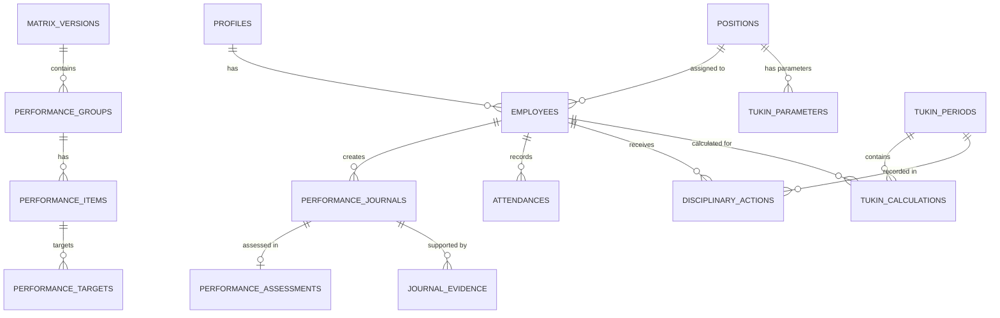

# IMPLEMENTATION SPECIFICATION FINAL V3 — DATABASE READY

Dokumen ini merupakan arsitektur definitif (*Database Ready*) yang menginkorporasikan pengerasan (*hardening*) keamanan, imutabilitas penuh (*historical integrity*), serta abstraksi fleksibel pada mesin hitung (*Calculation Engine*). Tidak ada asumsi bisnis yang dibuat secara diam-diam.

---

## A. Updated ERD (Entity Relationship Diagram)


---

## B. Complete Table Definitions & C. PK/FK Definitions

1. **`profiles`**
   - `id` (uuid, PK, references auth.users)
   - `role` (varchar: 'admin', 'user')
   - `full_name` (varchar)

2. **`positions`**
   - `id` (uuid, PK)
   - `name` (varchar)
   - `is_pamong_tukin_eligible` (boolean)

3. **`employees`**
   - `id` (uuid, PK)
   - `profile_id` (uuid, FK profiles, RESTRICT)
   - `position_id` (uuid, FK positions, RESTRICT)
   - `nip_nipt` (varchar)
   - `status` (varchar: 'active', 'inactive')

4. **`tukin_parameters`**
   - `id` (uuid, PK)
   - `position_id` (uuid, FK positions, RESTRICT)
   - `min_ckb_target` (int)
   - `pagu_tukin` (numeric)
   - `effective_from` (date)
   - `effective_to` (date, nullable)

5. **`matrix_versions`**, **`performance_groups`**, **`performance_items`**, **`performance_targets`**
   - *Struktur standar (lihat V2). Relasi antar-master diubah menjadi `RESTRICT` jika direferensikan oleh jurnal historis.*

6. **`performance_journals`** (Diperkuat)
   - `id` (uuid, PK)
   - `employee_id` (uuid, FK employees, RESTRICT)
   - `item_id` (uuid, FK performance_items, RESTRICT)
   - `activity_date` (date)
   - `start_time` (time)
   - `end_time` (time)
   - **Historical Snapshots**: `matrix_version_id_snapshot`, `group_name_snapshot`, `item_name_snapshot`, `target_snapshot`, `unit_snapshot`
   - `realization` (int - Kuantitas output saja)
   - `location` (varchar), `note` (text), `status` (varchar)
   - `return_reason` (text, nullable)

7. **`performance_assessments`**
   - `id` (uuid, PK)
   - `journal_id` (uuid, FK performance_journals, RESTRICT)
   - `assessed_realization` (int)
   - `capaian_value` (numeric)
   - `assessment_note` (text)
   - `assessed_by` (uuid, FK profiles, RESTRICT)
   - `assessed_at` (timestamptz)

8. **`disciplinary_actions`**
   - `id` (uuid, PK)
   - `employee_id` (uuid, FK employees, RESTRICT)
   - `period_id` (uuid, FK tukin_periods, RESTRICT)
   - `warning_level` (varchar)
   - `adjustment_percentage` (numeric)
   - `reason` (text)
   - `document_reference` (varchar)
   - `issued_by` (uuid, FK profiles)
   - `issued_at` (timestamptz)

9. **`tukin_periods`**
   - `id` (uuid, PK)
   - `period_month` (varchar YYYY-MM)
   - `status` (varchar: 'Draft', 'Locked')

10. **`tukin_calculations`** (Diperkuat)
    - `id` (uuid, PK)
    - `period_id` (uuid, FK tukin_periods, RESTRICT)
    - `employee_id` (uuid, FK employees, RESTRICT)
    - **Snapshot Eligibility**: `tukin_formula_role` (Pamong/Lurah), `lurah_average_eligible` (boolean)
    - **Snapshot Parameter**: `position_id_snapshot`, `pagu_snapshot`, `min_ckb_snapshot`, `formula_version`
    - **Lurah Audit Trail**: `calculation_type`, `eligible_count`, `eligible_percentage_sum`, `average_eligible_percentage`
    - **Pamong Core Inputs**: `mk`, `hk`, `pb`, `ckb`, `tkb`, `actual_kb`, `kb_used_for_npk`
    - **Final Results**: `npk`, `tukin_percentage`, `disciplinary_adjustment`, `final_tukin`

---

## D, E, F. Database Constraints
- **UNIQUE Constraints**:
  - `UNIQUE(employee_id, attendance_date)` di `attendances`.
  - `UNIQUE(period_id, employee_id)` di `tukin_calculations`.
  - `UNIQUE(period_month)` di `tukin_periods`.
  - `UNIQUE(journal_id)` di `performance_assessments`.
- **CHECK Constraints**:
  - `CHECK (start_time < end_time)` di `performance_journals`.
  - `CHECK (status IN ('Draft', 'Submitted', 'Verified', 'Returned', 'Approved', 'Locked'))` di Jurnal.
- **GiST Exclusion Constraints**:
  - `EXCLUDE USING gist (employee_id WITH =, tsrange((activity_date + start_time)::timestamp, (activity_date + end_time)::timestamp) WITH &&)` di Jurnal.
  - `EXCLUDE USING gist (position_id WITH =, daterange(effective_from, effective_to) WITH &&)` di Tukin Parameters.

---

## G. RLS Operation Matrix (Hardened)

| Domain | Role: Pamong (User) | Role: Carik (Admin) | Role: Lurah (Evaluator) |
|---|---|---|---|
| **Journals** | `SELECT` (Sendiri)<br>`INSERT` (Sendiri, stat Draft)<br>`UPDATE` (Sendiri, hny jk Draft/Returned)<br>`DELETE` (Sendiri, hny Draft) | `SELECT` (Semua) | `SELECT` (Semua) |
| **Assessments**| `SELECT` (Milik jurnalnya) | `SELECT` (Semua) | `SELECT` (Semua)<br>`INSERT` (Jurnal Verified)<br>`UPDATE` (Jurnal belum Locked) |
| **Calculations**| `SELECT` (Sendiri) | `SELECT` (Semua) | `SELECT` (Semua) |

*(Note: Data perhitungan akhir `tukin_calculations` tidak dapat di-`INSERT`/`UPDATE` secara manual oleh siapapun dari sisi klien. Hanya RPC/Server Action sistem yang memiliki wewenang).*

---

## H. State Transition Matrix (Jurnal)

| Current State | Target State | Action / RPC | Who Can Execute | Condition / Rule |
|---|---|---|---|---|
| *None* | `Draft` | `create_journal()` | Pamong | Milik Sendiri |
| `Draft` / `Returned` | `Submitted` | `submit_journal()` | Pamong | Milik Sendiri |
| `Submitted` | `Returned` | `return_journal()` | Carik | Wajib isi `return_reason` |
| `Submitted` | `Verified` | `verify_journal()` | Carik | Secara Administratif |
| `Verified` | `Returned` | `return_journal()` | Lurah | Wajib isi `return_reason` |
| `Verified` | `Approved` | `approve_journal()` | Lurah | Wajib membuat *Assessment* substantif |
| `Approved` | `Locked` | `lock_journal()` | Sistem (End of Period) | Searah. Tidak bisa mundur. |

---

## I. RPC/Server Action Authorization Matrix
Sistem mendelegasikan perubahan transisi state hanya melalui fungsi berikut (via DB Function / Next.js Server Action terotorisasi):
- **Is_Lurah_Check()**: Fungsi internal otorisasi mengecek apakah *authenticated user* adalah pegawai aktif dengan `position` = Lurah. Hanya ini yang bisa menembus eksekusi `approve_journal()`.
- **generate_calculations()**: RPC/Job yang hanya bisa dijalankan Carik/Sistem. Mengunci seluruh *Approved Journals* menjadi `Locked` dan menulis ke `tukin_calculations`.
- Seluruh RPC memvalidasi mutlak kepemilikan dan hak akses (Backend Validation). `Frontend authorization` tidak dianggap sah.

---

## J. Calculation Engine Input/Output Contract
*Interface* diabstraksi agar logika *partial realization* dan *capping* dapat diputuskan secara terpisah:

```typescript
// IN: Realisasi kuantitatif & Target Snapshot. OUT: Capaian mutlak (BLOCKED: Skema parsial).
interface CapaianCalculator {
    calculate(target: number, realization: number): number;
}
// IN: Total CKB & TK.B. OUT: Actual KB & KB yang diakui untuk NPK (BLOCKED: Aturan Capping).
interface KBCalculator {
    calculateKB(ckb: number, tkb: number): { actualKB: number, kbUsedForNPK: number };
}
```

---

## K. Historical Snapshot Strategy
- Saat Jurnal di-*submit*, sistem menyalin kolom nama matriks, target, satuan ke jurnal secara utuh (Isolasi Jurnal).
- Saat Tukin `Locked`, record `tukin_calculations` tidak akan berelasi langsung dengan master untuk perhitungan uang. `pagu_snapshot`, `tkb`, `pb`, dan tabel penilaian disalin murni ke dalam kalkulasi.

---

## L. Lurah Calculation Strategy
Tukin Lurah dihitung murni dengan formula: `average_eligible_percentage * pagu_snapshot`.
- Populasi Pembangun Rata-rata: Dicari dari `tukin_calculations` dengan periode sama yang memegang field `lurah_average_eligible = TRUE`. 
- Penentuan Eligibility ini disuntik (snapshot) saat periode dihitung berdasarkan `tukin_formula_role` dan posisi di bulan tersebut (Misal: Staf tidak *eligible* kecuali diubah konfigurasinya kelak).

---

## M. Disciplinary Strategy
- Terpisah secara sistem dalam tabel `disciplinary_actions`. Sanksi diterbitkan oleh pihak berwenang per periode, dicatat dengan alasan dan `adjustment_percentage` (misal 5% deduction).
- Engine kalkulasi mengambil `adjustment_percentage` ini lalu di-snapshot ke dalam `tukin_calculations.disciplinary_adjustment` sebagai pemotong nilai final Tukin.

---

## N. Attendance-to-PB Calculation Specification
1. PB = (MK / HK) * 100%.
2. *Source*: `attendances` (HK) yang ditarik dari *village_settings* / hari aktif.
3. *Undefined Rules* (Ditandai sebagai **BUSINESS DECISION REQUIRED**):
   - Bagaimana status `leave`, `permission`, `official duty`, dan libur nasional dihitung (apakah ekuivalen 1 MK)?
   - Aturan toleransi keterlambatan/pulang cepat.
   - Presensi manual/missing checkout.

---

## O. Migration Order
1. `001_extensions.sql` (UUID, GiST, Enums).
2. `002_core.sql` (Profiles, Positions, Employees, Settings).
3. `003_tukin_parameters.sql` (Tukin Parameters + GiST Daterange).
4. `004_matrix.sql` (Matrix, Groups, Items, Targets).
5. `005_attendance_discipline.sql` (Attendance, Permissions, Duties, Disciplinary Actions).
6. `006_journals.sql` (Journals + GiST Tsrange, Evidence, Assessments).
7. `007_calculations.sql` (Periods, Tukin Calculations full snapshot).
8. `008_rls.sql` (Policies RLS dan RPC state validation).
9. `009_seed.sql` (Data awal Kalidengen).

---

## P. Seed Requirements for Kalurahan Kalidengen
- `village_settings`: Identitas Kalidengen.
- `positions` + `tukin_parameters`: Master pagu dan target (Carik 40, Kasi 39, Dukuh 38) di-seed dengan `effective_from` = 2026-01-01. Set *flag* populasi rata-rata Tukin Lurah `is_pamong_tukin_eligible`.
- `profiles` + `employees`: 10 pegawai yang diuraikan owner. 
- *Semua matrix di-seed terisolasi* (Bamuskal tidak dimasukkan, Staf masuk *template*).

---

## Q. Explicit List of Remaining Unresolved Business Decisions

Berikut adalah daftar ranah aturan fungsional yang dibiarkan menggantung (*Unresolved*) dalam kode dan membutuhkan ketukan palu Owner di masa depan:

1. **Aturan Capping KB**: Apakah kinerja bulanan dibiarkan menembus >100% atau dipotong paksa.
2. **Hitungan Capaian Parsial Output**: Mekanisme penganugerahan angka capaian jika kuantitas realisasi < angka target minimum.
3. **Pembulatan (Rounding) NPK**: Aturan pembulatan/pengabaian desimal apabila angka pecahan NPK jatuh di batas tak diatur (misal: 90.99).
4. **Definisi MK (Masuk Kerja) Valid**: Regulasi atas perlakuan Cuti, Dinas Luar, Tidak *Check-Out*, Izin, dan Keterlambatan dalam rumusan MK harian.
